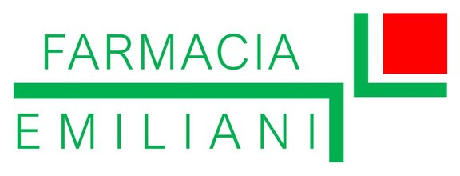

/**
 * Avviso email al farmacista quando arriva una nuova richiesta dal sito.
 * Si incolla in Google Apps Script (vedi LEGGIMI.md) e si pubblica come "App web".
 * Le email partono dall'account Google con cui lo pubblichi.
 */

// Parola segreta: cambiala con una frase lunga e casuale. Deve essere uguale a quella
// messa nell'indirizzo del webhook in supabase-notifiche.sql.
var SECRET = 'CAMBIA-QUESTA-FRASE-SEGRETA';

// Link all'archivio (per il pulsante nell'email). Metti il vostro dominio.
var LINK_ARCHIVIO = 'https://TUODOMINIO.it/archivio.html';

var EMAIL_SEDE = {
  emiliani:   'staffemiliani@gmail.com',
  sanluca:    'staff.sanluca@gmail.com',
  strampelli: 'staff.strampelli@gmail.com'
};
var NOME_SEDE = { emiliani: 'Emiliani', sanluca: 'San Luca', strampelli: 'Strampelli' };

function pulisci(v, max) {
  return String(v == null ? '' : v).replace(/[\r\n]+/g, ' ').slice(0, max || 200);
}

function doPost(e) {
  if (!e || !e.parameter || e.parameter.key !== SECRET) {
    return ContentService.createTextOutput('non autorizzato');
  }
  var dati = JSON.parse(e.postData.contents);
  var r = dati.record || {};
  var to = EMAIL_SEDE[r.sede];
  if (!to) return ContentService.createTextOutput('sede sconosciuta');

  var righe = [
    'Farmacia: ' + NOME_SEDE[r.sede],
    'Servizio: ' + pulisci(r.servizio, 120)
  ];
  if (r.modalita) righe.push('Modalità: ' + pulisci(r.modalita, 60));
  if (r.giorno || r.fascia) righe.push('Preferenza: ' + pulisci([r.giorno, r.fascia].join(' '), 60));
  if (r.nome) righe.push('Nome: ' + pulisci(r.nome, 100));
  if (r.telefono) righe.push('Telefono: ' + pulisci(r.telefono, 30));
  if (r.note) righe.push('Note: ' + pulisci(r.note, 500));
  righe.push('', 'Gestiscila nell\'archivio: ' + LINK_ARCHIVIO);

  MailApp.sendEmail({
    to: to,
    subject: 'Nuova richiesta: ' + pulisci(r.servizio, 80) + ' (' + NOME_SEDE[r.sede] + ')',
    body: righe.join('\n'),
    name: 'Sito Farmacie Roma'
  });
  return ContentService.createTextOutput('ok');
}

.DS_Store
Thumbs.db

<!DOCTYPE html>
<html lang="it">
<head>
<meta charset="utf-8">
<meta name="viewport" content="width=device-width, initial-scale=1, viewport-fit=cover">
<title>Archivio richieste · Farmacie Roma</title>
<meta name="description" content="Area riservata">
<meta name="robots" content="noindex, nofollow">
<link rel="icon" type="image/png" href="assets/img/logo-gruppo.png">
<link rel="preconnect" href="https://fonts.googleapis.com">
<link rel="preconnect" href="https://fonts.gstatic.com" crossorigin>
<link href="https://fonts.googleapis.com/css2?family=Bricolage+Grotesque:wght@500;700;800&family=Figtree:wght@400;500;600&display=swap" rel="stylesheet">
<link rel="stylesheet" href="assets/style.css">

</head>
<body>
<header>
<a class="brand" href="index.html">Farmacie Roma</a><button type="button" class="btnl" id="out" hidden>Esci</button>
</header>
<main id="top" tabindex="-1">
<section>

<h1 class="ph">Archivio richieste</h1>

L'archivio non è ancora collegato. Compila <b>assets/config.js</b> come indicato nel file LEGGIMI.md.

  <h2>Accesso riservato al personale</h2>
  <form id="lf"><label for="em">Email</label><input type="email" id="em" autocomplete="username" required>
  <label for="pw">Password</label><input type="password" id="pw" autocomplete="current-password" required>
  

  <button class="btn" type="submit" style="background:var(--brand);color:var(--brand-ink);margin-top:12px">Entra</button></form>

  

  

  
<input type="search" id="q" placeholder="Cerca nome, telefono, servizio…" aria-label="Cerca"><button type="button" class="btnl" id="csv" style="background:var(--brand);color:var(--brand-ink)">Scarica CSV</button>

  

</section>
</main>

</body>
</html>
<!DOCTYPE html>
<html lang="it">
<head>
<meta charset="utf-8">
<meta name="viewport" content="width=device-width, initial-scale=1, viewport-fit=cover">
<title>Convenzioni ASL · Farmacie Roma</title>
<meta name="description" content="Servizi in convenzione ASL e mutuabili nelle farmacie Emiliani, San Luca e Strampelli a Roma: vaccini, Holter e sangue occulto nelle feci.">
<link rel="icon" type="image/png" href="assets/img/logo-gruppo.png">
<link rel="preconnect" href="https://fonts.googleapis.com">
<link rel="preconnect" href="https://fonts.gstatic.com" crossorigin>
<link href="https://fonts.googleapis.com/css2?family=Bricolage+Grotesque:wght@500;700;800&family=Figtree:wght@400;500;600&display=swap" rel="stylesheet">
<link rel="stylesheet" href="assets/style.css">

</head>
<body>
<header>

  <a class="brand" href="index.html">Farmacie Roma</a>
  <button type="button" class="navbtn" id="navbtn" aria-expanded="false" aria-controls="nav" aria-label="Menu"><svg width="24" height="24" viewBox="0 0 24 24" fill="none" stroke="currentColor" stroke-width="2.4" stroke-linecap="round" aria-hidden="true"><path d="M4 7h16M4 12h16M4 17h16"/></svg></button>
  <nav id="nav" aria-label="Principale"><a href="index.html">Home</a><a href="servizi.html">Servizi</a><a href="convenzioni.html" aria-current="page">Convenzioni</a><a href="farmacie.html">Farmacie</a></nav>

</header>
<main id="top" tabindex="-1">
<section>
<h1 class="ph">Convenzioni ASL e servizi mutuabili</h1>

Alcuni servizi si possono fare in convenzione con l'ASL o come prestazione mutuabile, altri a pagamento. Ecco il quadro.

<table><thead><tr><th scope="col">Servizio</th><th scope="col">Con il Servizio Sanitario</th><th scope="col">A pagamento</th></tr></thead><tbody><tr><th scope="row">Vaccino antinfluenzale</th><td>Convenzione ASL</td><td>Sì</td></tr><tr><th scope="row">Vaccino HPV</th><td>Convenzione ASL</td><td>Sì</td></tr><tr><th scope="row">Vaccino antipneumococcico</th><td>Convenzione ASL</td><td>Sì</td></tr><tr><th scope="row">Holter cardiaco</th><td>Mutuabile</td><td>Sì</td></tr><tr><th scope="row">Holter pressorio</th><td>Mutuabile</td><td>Sì</td></tr><tr><th scope="row">Sangue occulto nelle feci</th><td>Convenzione ASL</td><td>—</td></tr></tbody></table>

Per sapere cosa serve e quanto costa, chiedi alla farmacia che preferisci.

<button type="button" class="btnl" id="askwa">Scrivi a una farmacia</button><a class="more" href="servizi.html" style="margin:0">Vedi tutti i servizi</a>

</section>
</main>
<footer>
<strong>Gruppo di farmacie a Roma</strong>

<address>Farmacia Emiliani · Via Cantiano, 62/A, 00132 Roma · 06 220 3046</address><address>Farmacia San Luca · Via di Acqua Bullicante, 70, 00177 Roma · 06 2440 0522</address><address>Farmacia Strampelli · Via di Santa Croce in Gerusalemme, 22A, 00185 Roma · 06 702 8004</address><address>Orari indicativi: possono variare nei giorni festivi.</address><address>Trovaci su Google: <a href="https://www.google.com/maps/place/?q=place_id:ChIJH382Q7F-LxMRiJyVyYdh7GQ" target="_blank" rel="noopener">scheda di Farmacia Emiliani</a>  · <a href="https://search.google.com/local/writereview?placeid=ChIJH382Q7F-LxMRiJyVyYdh7GQ" target="_blank" rel="noopener">lascia una recensione</a></address><address><a href="privacy.html">Informativa privacy</a></address>
</footer>
<dialog id="dlg" aria-labelledby="dt">

  <button type="button" class="x" id="dx" aria-label="Chiudi">&times;</button>
  <h2 id="dt"></h2>
  <fieldset><legend>Farmacia</legend>
    

      <input type="radio" name="df" id="d1" value="393331804161|Emiliani" checked><label for="d1" style="--c:var(--emiliani)">EmilianiVia Cantiano, 62/A · Corcolle</label>
      <input type="radio" name="df" id="d2" value="393890336019|San Luca"><label for="d2" style="--c:var(--sanluca)">San LucaVia di Acqua Bullicante, 70 · Torpignattara</label>
      <input type="radio" name="df" id="d3" value="393403515536|Strampelli"><label for="d3" style="--c:var(--strampelli)">StrampelliVia S. Croce in Gerusalemme, 22A · San Giovanni</label>
    

    <button type="button" class="geob" id="dgeob">Trova la più vicina a me</button>

</fieldset>
  <fieldset id="modes" hidden><legend id="ml"></legend>

</fieldset>
  

    <fieldset><legend><label for="dd" style="font-weight:600">Giorno preferito</label></legend><input type="date" id="dd"></fieldset>
    <fieldset><legend>Fascia oraria</legend>
      

        <input type="radio" name="dh" id="h1" value="" checked><label for="h1">Indifferente</label>
        <input type="radio" name="dh" id="h2" value="di mattina"><label for="h2">Mattina</label>
        <input type="radio" name="dh" id="h3" value="di pomeriggio"><label for="h3">Pomeriggio</label>
      
</fieldset>
  

  <fieldset><legend><label for="dn" style="font-weight:600">Nome e cognome (facoltativo)</label></legend><input type="text" id="dn" autocomplete="name"></fieldset>
  <fieldset><legend><label for="dp" style="font-weight:600">Telefono per essere ricontattati (facoltativo)</label></legend><input type="tel" id="dp" autocomplete="tel" inputmode="tel"></fieldset>
  <fieldset><legend><label for="dm" style="font-weight:600">Note (facoltativo)</label></legend><textarea id="dm"></textarea></fieldset>
  

  
<label>Sito web <input type="text" id="website" tabindex="-1" autocomplete="off"></label>

  <a class="btn" id="dgo" href="#" target="_blank" rel="noopener" style="margin-top:14px">Invia su WhatsApp</a>
  
La richiesta viene registrata dalla farmacia scelta per gestirla. <a href="privacy.html">Informativa privacy</a>

</dialog>

  

Con quale farmacia vuoi parlare?

<a class="mwa" target="_blank" rel="noopener" href="https://wa.me/393331804161"><b>Emiliani</b>333 180 4161</a><a class="mcall" href="tel:+39062203046" aria-label="Chiama Emiliani"><svg width="22" height="22" viewBox="0 0 24 24" fill="none" stroke="currentColor" stroke-width="2" stroke-linecap="round" stroke-linejoin="round" aria-hidden="true"><path d="M22 16.9v3a2 2 0 0 1-2.2 2 19.8 19.8 0 0 1-8.6-3.1 19.5 19.5 0 0 1-6-6A19.8 19.8 0 0 1 2.1 4.2 2 2 0 0 1 4.1 2h3a2 2 0 0 1 2 1.7c.1 1 .4 1.9.7 2.8a2 2 0 0 1-.5 2.1L8.1 9.9a16 16 0 0 0 6 6l1.3-1.3a2 2 0 0 1 2.1-.4c.9.3 1.8.6 2.8.7a2 2 0 0 1 1.7 2z"/></svg></a>

<a class="mwa" target="_blank" rel="noopener" href="https://wa.me/393890336019"><b>San Luca</b>389 033 6019</a><a class="mcall" href="tel:+390624400522" aria-label="Chiama San Luca"><svg width="22" height="22" viewBox="0 0 24 24" fill="none" stroke="currentColor" stroke-width="2" stroke-linecap="round" stroke-linejoin="round" aria-hidden="true"><path d="M22 16.9v3a2 2 0 0 1-2.2 2 19.8 19.8 0 0 1-8.6-3.1 19.5 19.5 0 0 1-6-6A19.8 19.8 0 0 1 2.1 4.2 2 2 0 0 1 4.1 2h3a2 2 0 0 1 2 1.7c.1 1 .4 1.9.7 2.8a2 2 0 0 1-.5 2.1L8.1 9.9a16 16 0 0 0 6 6l1.3-1.3a2 2 0 0 1 2.1-.4c.9.3 1.8.6 2.8.7a2 2 0 0 1 1.7 2z"/></svg></a>

<a class="mwa" target="_blank" rel="noopener" href="https://wa.me/393403515536"><b>Strampelli</b>340 351 5536</a><a class="mcall" href="tel:+39067028004" aria-label="Chiama Strampelli"><svg width="22" height="22" viewBox="0 0 24 24" fill="none" stroke="currentColor" stroke-width="2" stroke-linecap="round" stroke-linejoin="round" aria-hidden="true"><path d="M22 16.9v3a2 2 0 0 1-2.2 2 19.8 19.8 0 0 1-8.6-3.1 19.5 19.5 0 0 1-6-6A19.8 19.8 0 0 1 2.1 4.2 2 2 0 0 1 4.1 2h3a2 2 0 0 1 2 1.7c.1 1 .4 1.9.7 2.8a2 2 0 0 1-.5 2.1L8.1 9.9a16 16 0 0 0 6 6l1.3-1.3a2 2 0 0 1 2.1-.4c.9.3 1.8.6 2.8.7a2 2 0 0 1 1.7 2z"/></svg></a>

  <button id="fab" aria-expanded="false" aria-controls="menu"><svg width="28" height="28" viewBox="0 0 24 24" fill="currentColor" aria-hidden="true"><path d="M17.472 14.382c-.297-.149-1.758-.867-2.03-.967-.273-.099-.471-.148-.67.15-.197.297-.767.966-.94 1.164-.173.199-.347.223-.644.075-.297-.15-1.255-.463-2.39-1.475-.883-.788-1.48-1.761-1.653-2.059-.173-.297-.018-.458.13-.606.134-.133.298-.347.446-.52.149-.174.198-.298.298-.497.099-.198.05-.371-.025-.52-.075-.149-.669-1.612-.916-2.207-.242-.579-.487-.5-.669-.51-.173-.008-.371-.01-.57-.01-.198 0-.52.074-.792.372-.272.297-1.04 1.016-1.04 2.479 0 1.462 1.065 2.875 1.213 3.074.149.198 2.096 3.2 5.077 4.487.709.306 1.262.489 1.694.625.712.227 1.36.195 1.871.118.571-.085 1.758-.719 2.006-1.413.248-.694.248-1.289.173-1.413-.074-.124-.272-.198-.57-.347m-5.421 7.403h-.004a9.87 9.87 0 01-5.031-1.378l-.361-.214-3.741.982.998-3.648-.235-.374a9.86 9.86 0 01-1.51-5.26c.001-5.45 4.436-9.884 9.888-9.884 2.64 0 5.122 1.03 6.988 2.898a9.825 9.825 0 012.893 6.994c-.003 5.45-4.437 9.884-9.885 9.884m8.413-18.297A11.815 11.815 0 0012.05 0C5.495 0 .16 5.335.157 11.892c0 2.096.547 4.142 1.588 5.945L.057 24l6.305-1.654a11.882 11.882 0 005.683 1.448h.005c6.554 0 11.89-5.335 11.893-11.893a11.821 11.821 0 00-3.48-8.413Z"/></svg>Scrivici</button>

</body>
</html>
<!DOCTYPE html>
<html lang="it">
<head>
<meta charset="utf-8">
<meta name="viewport" content="width=device-width, initial-scale=1, viewport-fit=cover">
<title>Le nostre farmacie · Farmacie Roma</title>
<meta name="description" content="Indirizzi, orari e contatti delle farmacie Emiliani, San Luca e Strampelli a Roma.">
<link rel="icon" type="image/png" href="assets/img/logo-gruppo.png">
<link rel="preconnect" href="https://fonts.googleapis.com">
<link rel="preconnect" href="https://fonts.gstatic.com" crossorigin>
<link href="https://fonts.googleapis.com/css2?family=Bricolage+Grotesque:wght@500;700;800&family=Figtree:wght@400;500;600&display=swap" rel="stylesheet">
<link rel="stylesheet" href="assets/style.css">

</head>
<body>
<header>

  <a class="brand" href="index.html">Farmacie Roma</a>
  <button type="button" class="navbtn" id="navbtn" aria-expanded="false" aria-controls="nav" aria-label="Menu"><svg width="24" height="24" viewBox="0 0 24 24" fill="none" stroke="currentColor" stroke-width="2.4" stroke-linecap="round" aria-hidden="true"><path d="M4 7h16M4 12h16M4 17h16"/></svg></button>
  <nav id="nav" aria-label="Principale"><a href="index.html">Home</a><a href="servizi.html">Servizi</a><a href="convenzioni.html">Convenzioni</a><a href="farmacie.html" aria-current="page">Farmacie</a></nav>

</header>
<main id="top" tabindex="-1">
<section id="farmacie">

  <h1 class="ph">Le nostre farmacie</h1>
  
Tre sedi a Roma: indirizzo, orari e contatti di ognuna.

  

    <article class="card" style="--c:var(--emiliani)">

<h3><a class="cardlink" href="https://www.google.com/maps/place/?q=place_id:ChIJH382Q7F-LxMRiJyVyYdh7GQ" target="_blank" rel="noopener">Farmacia Emiliani - apri la scheda su Google</a></h3>

      <address>Via Cantiano, 62/A 00132 Roma · <a href="https://www.google.com/maps/dir/?api=1&amp;destination=Farmacia%20Emiliani&amp;destination_place_id=ChIJH382Q7F-LxMRiJyVyYdh7GQ" target="_blank" rel="noopener">Indicazioni</a></address>
      <ul class="hrs"><li>Lunedì–venerdì 8:30–20:00</li><li>Sabato 8:30–13:00</li><li>Domenica chiusa</li></ul>
      
WhatsApp 333 180 4161

      

      
<a href="https://www.google.com/maps/place/?q=place_id:ChIJH382Q7F-LxMRiJyVyYdh7GQ" target="_blank" rel="noopener">Vedi su Google Maps</a> · <a href="https://search.google.com/local/writereview?placeid=ChIJH382Q7F-LxMRiJyVyYdh7GQ" target="_blank" rel="noopener">Lascia una recensione</a>

      
<a class="btn" target="_blank" rel="noopener" href="https://wa.me/393331804161">Scrivi su WhatsApp</a><a class="tel" href="tel:+39062203046">Chiama 06 220 3046</a>
</article>
    <article class="card" style="--c:var(--sanluca)">

<h3><a class="cardlink" href="https://www.google.com/maps/place/?q=place_id:ChIJL9sEBT1iLxMRGhrkAy4iJFs" target="_blank" rel="noopener">Farmacia San Luca - apri la scheda su Google</a></h3>

      <address>Via di Acqua Bullicante, 70 00177 Roma · <a href="https://www.google.com/maps/dir/?api=1&amp;destination=Farmacia%20San%20Luca&amp;destination_place_id=ChIJL9sEBT1iLxMRGhrkAy4iJFs" target="_blank" rel="noopener">Indicazioni</a></address>
      <ul class="hrs"><li>Lunedì–venerdì 8:30–20:00</li><li>Sabato 8:30–13:00</li><li>Domenica chiusa</li></ul>
      
WhatsApp 389 033 6019

      
<a href="https://www.google.com/maps/place/?q=place_id:ChIJL9sEBT1iLxMRGhrkAy4iJFs" target="_blank" rel="noopener">Vedi su Google Maps</a> · <a href="https://search.google.com/local/writereview?placeid=ChIJL9sEBT1iLxMRGhrkAy4iJFs" target="_blank" rel="noopener">Lascia una recensione</a>

      
<a class="btn" target="_blank" rel="noopener" href="https://wa.me/393890336019">Scrivi su WhatsApp</a><a class="tel" href="tel:+390624400522">Chiama 06 2440 0522</a>
</article>
    <article class="card" style="--c:var(--strampelli)">

<h3><a class="cardlink" href="https://www.google.com/maps/place/?q=place_id:ChIJG0-y5ZNhLxMRQLBoApzZKh0" target="_blank" rel="noopener">Farmacia Strampelli - apri la scheda su Google</a></h3>

      <address>Via di Santa Croce in Gerusalemme, 22A 00185 Roma · <a href="https://www.google.com/maps/dir/?api=1&amp;destination=Farmacia%20Strampelli&amp;destination_place_id=ChIJG0-y5ZNhLxMRQLBoApzZKh0" target="_blank" rel="noopener">Indicazioni</a></address>
      <ul class="hrs"><li>Lunedì–venerdì 8:30–20:00</li><li>Sabato 8:30–13:00 e 16:00–19:30</li><li>Domenica chiusa</li></ul>
      
WhatsApp 340 351 5536

      
<a href="https://www.google.com/maps/place/?q=place_id:ChIJG0-y5ZNhLxMRQLBoApzZKh0" target="_blank" rel="noopener">Vedi su Google Maps</a> · <a href="https://search.google.com/local/writereview?placeid=ChIJG0-y5ZNhLxMRQLBoApzZKh0" target="_blank" rel="noopener">Lascia una recensione</a>

      
<a class="btn" target="_blank" rel="noopener" href="https://wa.me/393403515536">Scrivi su WhatsApp</a><a class="tel" href="tel:+39067028004">Chiama 06 702 8004</a>
</article>
  

</section>
</main>
<footer>
<strong>Gruppo di farmacie a Roma</strong>

<address>Farmacia Emiliani · Via Cantiano, 62/A, 00132 Roma · 06 220 3046</address><address>Farmacia San Luca · Via di Acqua Bullicante, 70, 00177 Roma · 06 2440 0522</address><address>Farmacia Strampelli · Via di Santa Croce in Gerusalemme, 22A, 00185 Roma · 06 702 8004</address><address>Orari indicativi: possono variare nei giorni festivi.</address><address>Trovaci su Google: <a href="https://www.google.com/maps/place/?q=place_id:ChIJH382Q7F-LxMRiJyVyYdh7GQ" target="_blank" rel="noopener">scheda di Farmacia Emiliani</a>  · <a href="https://search.google.com/local/writereview?placeid=ChIJH382Q7F-LxMRiJyVyYdh7GQ" target="_blank" rel="noopener">lascia una recensione</a></address><address><a href="privacy.html">Informativa privacy</a></address>
</footer>
<dialog id="dlg" aria-labelledby="dt">

  <button type="button" class="x" id="dx" aria-label="Chiudi">&times;</button>
  <h2 id="dt"></h2>
  <fieldset><legend>Farmacia</legend>
    

      <input type="radio" name="df" id="d1" value="393331804161|Emiliani" checked><label for="d1" style="--c:var(--emiliani)">EmilianiVia Cantiano, 62/A · Corcolle</label>
      <input type="radio" name="df" id="d2" value="393890336019|San Luca"><label for="d2" style="--c:var(--sanluca)">San LucaVia di Acqua Bullicante, 70 · Torpignattara</label>
      <input type="radio" name="df" id="d3" value="393403515536|Strampelli"><label for="d3" style="--c:var(--strampelli)">StrampelliVia S. Croce in Gerusalemme, 22A · San Giovanni</label>
    

    <button type="button" class="geob" id="dgeob">Trova la più vicina a me</button>

</fieldset>
  <fieldset id="modes" hidden><legend id="ml"></legend>

</fieldset>
  

    <fieldset><legend><label for="dd" style="font-weight:600">Giorno preferito</label></legend><input type="date" id="dd"></fieldset>
    <fieldset><legend>Fascia oraria</legend>
      

        <input type="radio" name="dh" id="h1" value="" checked><label for="h1">Indifferente</label>
        <input type="radio" name="dh" id="h2" value="di mattina"><label for="h2">Mattina</label>
        <input type="radio" name="dh" id="h3" value="di pomeriggio"><label for="h3">Pomeriggio</label>
      
</fieldset>
  

  <fieldset><legend><label for="dn" style="font-weight:600">Nome e cognome (facoltativo)</label></legend><input type="text" id="dn" autocomplete="name"></fieldset>
  <fieldset><legend><label for="dp" style="font-weight:600">Telefono per essere ricontattati (facoltativo)</label></legend><input type="tel" id="dp" autocomplete="tel" inputmode="tel"></fieldset>
  <fieldset><legend><label for="dm" style="font-weight:600">Note (facoltativo)</label></legend><textarea id="dm"></textarea></fieldset>
  

  
<label>Sito web <input type="text" id="website" tabindex="-1" autocomplete="off"></label>

  <a class="btn" id="dgo" href="#" target="_blank" rel="noopener" style="margin-top:14px">Invia su WhatsApp</a>
  
La richiesta viene registrata dalla farmacia scelta per gestirla. <a href="privacy.html">Informativa privacy</a>

</dialog>

  

Con quale farmacia vuoi parlare?

<a class="mwa" target="_blank" rel="noopener" href="https://wa.me/393331804161"><b>Emiliani</b>333 180 4161</a><a class="mcall" href="tel:+39062203046" aria-label="Chiama Emiliani"><svg width="22" height="22" viewBox="0 0 24 24" fill="none" stroke="currentColor" stroke-width="2" stroke-linecap="round" stroke-linejoin="round" aria-hidden="true"><path d="M22 16.9v3a2 2 0 0 1-2.2 2 19.8 19.8 0 0 1-8.6-3.1 19.5 19.5 0 0 1-6-6A19.8 19.8 0 0 1 2.1 4.2 2 2 0 0 1 4.1 2h3a2 2 0 0 1 2 1.7c.1 1 .4 1.9.7 2.8a2 2 0 0 1-.5 2.1L8.1 9.9a16 16 0 0 0 6 6l1.3-1.3a2 2 0 0 1 2.1-.4c.9.3 1.8.6 2.8.7a2 2 0 0 1 1.7 2z"/></svg></a>

<a class="mwa" target="_blank" rel="noopener" href="https://wa.me/393890336019"><b>San Luca</b>389 033 6019</a><a class="mcall" href="tel:+390624400522" aria-label="Chiama San Luca"><svg width="22" height="22" viewBox="0 0 24 24" fill="none" stroke="currentColor" stroke-width="2" stroke-linecap="round" stroke-linejoin="round" aria-hidden="true"><path d="M22 16.9v3a2 2 0 0 1-2.2 2 19.8 19.8 0 0 1-8.6-3.1 19.5 19.5 0 0 1-6-6A19.8 19.8 0 0 1 2.1 4.2 2 2 0 0 1 4.1 2h3a2 2 0 0 1 2 1.7c.1 1 .4 1.9.7 2.8a2 2 0 0 1-.5 2.1L8.1 9.9a16 16 0 0 0 6 6l1.3-1.3a2 2 0 0 1 2.1-.4c.9.3 1.8.6 2.8.7a2 2 0 0 1 1.7 2z"/></svg></a>

<a class="mwa" target="_blank" rel="noopener" href="https://wa.me/393403515536"><b>Strampelli</b>340 351 5536</a><a class="mcall" href="tel:+39067028004" aria-label="Chiama Strampelli"><svg width="22" height="22" viewBox="0 0 24 24" fill="none" stroke="currentColor" stroke-width="2" stroke-linecap="round" stroke-linejoin="round" aria-hidden="true"><path d="M22 16.9v3a2 2 0 0 1-2.2 2 19.8 19.8 0 0 1-8.6-3.1 19.5 19.5 0 0 1-6-6A19.8 19.8 0 0 1 2.1 4.2 2 2 0 0 1 4.1 2h3a2 2 0 0 1 2 1.7c.1 1 .4 1.9.7 2.8a2 2 0 0 1-.5 2.1L8.1 9.9a16 16 0 0 0 6 6l1.3-1.3a2 2 0 0 1 2.1-.4c.9.3 1.8.6 2.8.7a2 2 0 0 1 1.7 2z"/></svg></a>

  <button id="fab" aria-expanded="false" aria-controls="menu"><svg width="28" height="28" viewBox="0 0 24 24" fill="currentColor" aria-hidden="true"><path d="M17.472 14.382c-.297-.149-1.758-.867-2.03-.967-.273-.099-.471-.148-.67.15-.197.297-.767.966-.94 1.164-.173.199-.347.223-.644.075-.297-.15-1.255-.463-2.39-1.475-.883-.788-1.48-1.761-1.653-2.059-.173-.297-.018-.458.13-.606.134-.133.298-.347.446-.52.149-.174.198-.298.298-.497.099-.198.05-.371-.025-.52-.075-.149-.669-1.612-.916-2.207-.242-.579-.487-.5-.669-.51-.173-.008-.371-.01-.57-.01-.198 0-.52.074-.792.372-.272.297-1.04 1.016-1.04 2.479 0 1.462 1.065 2.875 1.213 3.074.149.198 2.096 3.2 5.077 4.487.709.306 1.262.489 1.694.625.712.227 1.36.195 1.871.118.571-.085 1.758-.719 2.006-1.413.248-.694.248-1.289.173-1.413-.074-.124-.272-.198-.57-.347m-5.421 7.403h-.004a9.87 9.87 0 01-5.031-1.378l-.361-.214-3.741.982.998-3.648-.235-.374a9.86 9.86 0 01-1.51-5.26c.001-5.45 4.436-9.884 9.888-9.884 2.64 0 5.122 1.03 6.988 2.898a9.825 9.825 0 012.893 6.994c-.003 5.45-4.437 9.884-9.885 9.884m8.413-18.297A11.815 11.815 0 0012.05 0C5.495 0 .16 5.335.157 11.892c0 2.096.547 4.142 1.588 5.945L.057 24l6.305-1.654a11.882 11.882 0 005.683 1.448h.005c6.554 0 11.89-5.335 11.893-11.893a11.821 11.821 0 00-3.48-8.413Z"/></svg>Scrivici</button>

</body>
</html>
<!DOCTYPE html>
<html lang="it">
<head>
<meta charset="utf-8">
<meta name="viewport" content="width=device-width, initial-scale=1, viewport-fit=cover">
<title>Farmacie Emiliani, San Luca e Strampelli · Roma</title>
<meta name="description" content="Farmacie Emiliani, San Luca e Strampelli a Roma: invia la ricetta, prenota vaccini, Holter, analisi e servizi, scrivi su WhatsApp alla farmacia più vicina.">
<link rel="icon" type="image/png" href="assets/img/logo-gruppo.png">
<link rel="preconnect" href="https://fonts.googleapis.com">
<link rel="preconnect" href="https://fonts.gstatic.com" crossorigin>
<link href="https://fonts.googleapis.com/css2?family=Bricolage+Grotesque:wght@500;700;800&family=Figtree:wght@400;500;600&display=swap" rel="stylesheet">
<link rel="stylesheet" href="assets/style.css">

</head>
<body>
<header>

  <a class="brand" href="index.html">Farmacie Roma</a>
  <button type="button" class="navbtn" id="navbtn" aria-expanded="false" aria-controls="nav" aria-label="Menu"><svg width="24" height="24" viewBox="0 0 24 24" fill="none" stroke="currentColor" stroke-width="2.4" stroke-linecap="round" aria-hidden="true"><path d="M4 7h16M4 12h16M4 17h16"/></svg></button>
  <nav id="nav" aria-label="Principale"><a href="index.html" aria-current="page">Home</a><a href="servizi.html">Servizi</a><a href="convenzioni.html">Convenzioni</a><a href="farmacie.html">Farmacie</a></nav>

</header>
<main id="top" tabindex="-1">

  

    <h1>Tre farmacie a Roma. Scrivi a quella che ti è più comoda.</h1>
    
Invia una ricetta, prenota un servizio o chiedi un prodotto: scegli prima cosa ti serve, poi la farmacia.

    

      <a class="chip logo l-emiliani" style="--c:var(--emiliani)" href="https://www.google.com/maps/place/?q=place_id:ChIJH382Q7F-LxMRiJyVyYdh7GQ" target="_blank" rel="noopener">Farmacia Emiliani - apri la scheda su Google</a>
      <a class="chip logo l-sanluca" style="--c:var(--sanluca)" href="https://www.google.com/maps/place/?q=place_id:ChIJL9sEBT1iLxMRGhrkAy4iJFs" target="_blank" rel="noopener">Farmacia San Luca - apri la scheda su Google</a>
      <a class="chip logo l-strampelli" style="--c:var(--strampelli)" href="https://www.google.com/maps/place/?q=place_id:ChIJG0-y5ZNhLxMRQLBoApzZKh0" target="_blank" rel="noopener">Farmacia Strampelli - apri la scheda su Google</a>
    

  

  

    <h2>Di cosa hai bisogno?</h2>
    
Ti apriamo WhatsApp con il messaggio già scritto.

    <fieldset><legend>1. Scegli il servizio</legend>
      

        <input type="radio" name="s" id="s1" value="Vorrei inviare una ricetta" checked><label for="s1">Invia una ricetta</label>
        <input type="radio" name="s" id="s2" value="Vorrei prenotare un servizio"><label for="s2">Prenota un servizio</label>
        <input type="radio" name="s" id="s3" value="Vorrei chiedere la disponibilità di un prodotto"><label for="s3">Chiedi un prodotto</label>
        <input type="radio" name="s" id="s4" value="Vorrei un'informazione"><label for="s4">Altra domanda</label>
      

    </fieldset>
    <fieldset><legend>2. Scegli la farmacia</legend>
      

        <input type="radio" name="f" id="f1" value="393331804161|Emiliani" checked><label for="f1" style="--c:var(--emiliani)">EmilianiVia Cantiano, 62/A · Corcolle</label>
        <input type="radio" name="f" id="f2" value="393890336019|San Luca"><label for="f2" style="--c:var(--sanluca)">San LucaVia di Acqua Bullicante, 70 · Torpignattara</label>
        <input type="radio" name="f" id="f3" value="393403515536|Strampelli"><label for="f3" style="--c:var(--strampelli)">StrampelliVia S. Croce in Gerusalemme, 22A · San Giovanni</label>
      

      <button type="button" class="geob" id="geob">Trova la più vicina a me</button>

    </fieldset>
    <fieldset><legend><label for="det" style="font-weight:600">3. Aggiungi i dettagli (facoltativo)</label></legend>
      <textarea id="det" placeholder="Es. nome del farmaco, giorno preferito…"></textarea>
    </fieldset>
    <a class="btn" id="go" href="#" target="_blank" rel="noopener">Scrivi su WhatsApp</a>
    
Non inviare dati sanitari sensibili se non richiesti dal farmacista.

    
La richiesta viene registrata dalla farmacia scelta per gestirla. <a href="privacy.html">Informativa privacy</a>

  

<section>
<h2>Servizi in evidenza</h2>
Tocca un servizio per prenotarlo o richiederlo.

<article class="svc" data-cat="r" data-book="0" data-phrase="inviare una ricetta" data-title="Invia una ricetta" data-ml="" data-modes="">
<h3>Invia una ricetta</h3>
Mandaci la ricetta prima di passare: la trovi pronta al ritiro.

<button type="button" class="svc-btn">Invia ricetta</button>
</article><article class="svc" data-cat="r" data-book="0" data-phrase="chiedere la disponibilità di un prodotto" data-title="Prodotti e consigli" data-ml="" data-modes="">
<h3>Prodotti e consigli</h3>
Chiedi se un prodotto è disponibile e fatti consigliare.

<button type="button" class="svc-btn">Chiedi un prodotto</button>
</article><article class="svc" data-cat="v" data-book="1" data-phrase="prenotare il vaccino antinfluenzale" data-title="Vaccino antinfluenzale" data-ml="Come vuoi farlo?" data-modes="In convenzione ASL|A pagamento">
<h3>Vaccino antinfluenzale</h3>
Prenota la vaccinazione stagionale.

Convenzione ASLA pagamento
<button type="button" class="svc-btn">Prenota</button>
</article><article class="svc" data-cat="c" data-book="1" data-phrase="prenotare la misurazione della pressione" data-title="Misurazione della pressione" data-ml="" data-modes="">
<h3>Misurazione della pressione</h3>
Un controllo rapido, senza appuntamento lungo.

<button type="button" class="svc-btn">Prenota</button>
</article><article class="svc" data-cat="a" data-book="1" data-phrase="prenotare il metabolic check (colesterolo, trigliceridi, HDL e LDL)" data-title="Metabolic check" data-ml="" data-modes="">
<h3>Metabolic check</h3>
Colesterolo totale, trigliceridi, HDL e LDL.

<button type="button" class="svc-btn">Prenota</button>
</article><article class="svc" data-cat="c" data-book="1" data-phrase="prenotare la foratura dei lobi" data-title="Foratura lobi" data-ml="" data-modes="">
<h3>Foratura lobi</h3>
Foratura dei lobi con il farmacista.

<button type="button" class="svc-btn">Prenota</button>
</article>
<a class="more" href="servizi.html">Vedi tutti i servizi</a>
</section>
<section>

<h2>Convenzioni ASL e servizi mutuabili</h2>
Vaccini, Holter e ricerca del sangue occulto nelle feci: scopri cosa è in convenzione.

<a class="btnl" href="convenzioni.html">Vedi le convenzioni</a>

</section>
<section>
<h2>Le nostre sedi</h2>
Tre farmacie a Roma, con gli stessi servizi.

<a class="mini" href="farmacie.html" style="--c:var(--emiliani)"><b>Farmacia Emiliani</b>Via Cantiano, 62/A</a><a class="mini" href="farmacie.html" style="--c:var(--sanluca)"><b>Farmacia San Luca</b>Via di Acqua Bullicante, 70</a><a class="mini" href="farmacie.html" style="--c:var(--strampelli)"><b>Farmacia Strampelli</b>Via di Santa Croce in Gerusalemme, 22A</a>

Farmacia Emiliani su Google: 

<a class="more" href="farmacie.html">Orari e contatti delle sedi</a>
</section>
</main>
<footer>
<strong>Gruppo di farmacie a Roma</strong>

<address>Farmacia Emiliani · Via Cantiano, 62/A, 00132 Roma · 06 220 3046</address><address>Farmacia San Luca · Via di Acqua Bullicante, 70, 00177 Roma · 06 2440 0522</address><address>Farmacia Strampelli · Via di Santa Croce in Gerusalemme, 22A, 00185 Roma · 06 702 8004</address><address>Orari indicativi: possono variare nei giorni festivi.</address><address>Trovaci su Google: <a href="https://www.google.com/maps/place/?q=place_id:ChIJH382Q7F-LxMRiJyVyYdh7GQ" target="_blank" rel="noopener">scheda di Farmacia Emiliani</a>  · <a href="https://search.google.com/local/writereview?placeid=ChIJH382Q7F-LxMRiJyVyYdh7GQ" target="_blank" rel="noopener">lascia una recensione</a></address><address><a href="privacy.html">Informativa privacy</a></address>
</footer>
<dialog id="dlg" aria-labelledby="dt">

  <button type="button" class="x" id="dx" aria-label="Chiudi">&times;</button>
  <h2 id="dt"></h2>
  <fieldset><legend>Farmacia</legend>
    

      <input type="radio" name="df" id="d1" value="393331804161|Emiliani" checked><label for="d1" style="--c:var(--emiliani)">EmilianiVia Cantiano, 62/A · Corcolle</label>
      <input type="radio" name="df" id="d2" value="393890336019|San Luca"><label for="d2" style="--c:var(--sanluca)">San LucaVia di Acqua Bullicante, 70 · Torpignattara</label>
      <input type="radio" name="df" id="d3" value="393403515536|Strampelli"><label for="d3" style="--c:var(--strampelli)">StrampelliVia S. Croce in Gerusalemme, 22A · San Giovanni</label>
    

    <button type="button" class="geob" id="dgeob">Trova la più vicina a me</button>

</fieldset>
  <fieldset id="modes" hidden><legend id="ml"></legend>

</fieldset>
  

    <fieldset><legend><label for="dd" style="font-weight:600">Giorno preferito</label></legend><input type="date" id="dd"></fieldset>
    <fieldset><legend>Fascia oraria</legend>
      

        <input type="radio" name="dh" id="h1" value="" checked><label for="h1">Indifferente</label>
        <input type="radio" name="dh" id="h2" value="di mattina"><label for="h2">Mattina</label>
        <input type="radio" name="dh" id="h3" value="di pomeriggio"><label for="h3">Pomeriggio</label>
      
</fieldset>
  

  <fieldset><legend><label for="dn" style="font-weight:600">Nome e cognome (facoltativo)</label></legend><input type="text" id="dn" autocomplete="name"></fieldset>
  <fieldset><legend><label for="dp" style="font-weight:600">Telefono per essere ricontattati (facoltativo)</label></legend><input type="tel" id="dp" autocomplete="tel" inputmode="tel"></fieldset>
  <fieldset><legend><label for="dm" style="font-weight:600">Note (facoltativo)</label></legend><textarea id="dm"></textarea></fieldset>
  

  
<label>Sito web <input type="text" id="website" tabindex="-1" autocomplete="off"></label>

  <a class="btn" id="dgo" href="#" target="_blank" rel="noopener" style="margin-top:14px">Invia su WhatsApp</a>
  
La richiesta viene registrata dalla farmacia scelta per gestirla. <a href="privacy.html">Informativa privacy</a>

</dialog>

  

Con quale farmacia vuoi parlare?

<a class="mwa" target="_blank" rel="noopener" href="https://wa.me/393331804161"><b>Emiliani</b>333 180 4161</a><a class="mcall" href="tel:+39062203046" aria-label="Chiama Emiliani"><svg width="22" height="22" viewBox="0 0 24 24" fill="none" stroke="currentColor" stroke-width="2" stroke-linecap="round" stroke-linejoin="round" aria-hidden="true"><path d="M22 16.9v3a2 2 0 0 1-2.2 2 19.8 19.8 0 0 1-8.6-3.1 19.5 19.5 0 0 1-6-6A19.8 19.8 0 0 1 2.1 4.2 2 2 0 0 1 4.1 2h3a2 2 0 0 1 2 1.7c.1 1 .4 1.9.7 2.8a2 2 0 0 1-.5 2.1L8.1 9.9a16 16 0 0 0 6 6l1.3-1.3a2 2 0 0 1 2.1-.4c.9.3 1.8.6 2.8.7a2 2 0 0 1 1.7 2z"/></svg></a>

<a class="mwa" target="_blank" rel="noopener" href="https://wa.me/393890336019"><b>San Luca</b>389 033 6019</a><a class="mcall" href="tel:+390624400522" aria-label="Chiama San Luca"><svg width="22" height="22" viewBox="0 0 24 24" fill="none" stroke="currentColor" stroke-width="2" stroke-linecap="round" stroke-linejoin="round" aria-hidden="true"><path d="M22 16.9v3a2 2 0 0 1-2.2 2 19.8 19.8 0 0 1-8.6-3.1 19.5 19.5 0 0 1-6-6A19.8 19.8 0 0 1 2.1 4.2 2 2 0 0 1 4.1 2h3a2 2 0 0 1 2 1.7c.1 1 .4 1.9.7 2.8a2 2 0 0 1-.5 2.1L8.1 9.9a16 16 0 0 0 6 6l1.3-1.3a2 2 0 0 1 2.1-.4c.9.3 1.8.6 2.8.7a2 2 0 0 1 1.7 2z"/></svg></a>

<a class="mwa" target="_blank" rel="noopener" href="https://wa.me/393403515536"><b>Strampelli</b>340 351 5536</a><a class="mcall" href="tel:+39067028004" aria-label="Chiama Strampelli"><svg width="22" height="22" viewBox="0 0 24 24" fill="none" stroke="currentColor" stroke-width="2" stroke-linecap="round" stroke-linejoin="round" aria-hidden="true"><path d="M22 16.9v3a2 2 0 0 1-2.2 2 19.8 19.8 0 0 1-8.6-3.1 19.5 19.5 0 0 1-6-6A19.8 19.8 0 0 1 2.1 4.2 2 2 0 0 1 4.1 2h3a2 2 0 0 1 2 1.7c.1 1 .4 1.9.7 2.8a2 2 0 0 1-.5 2.1L8.1 9.9a16 16 0 0 0 6 6l1.3-1.3a2 2 0 0 1 2.1-.4c.9.3 1.8.6 2.8.7a2 2 0 0 1 1.7 2z"/></svg></a>

  <button id="fab" aria-expanded="false" aria-controls="menu"><svg width="28" height="28" viewBox="0 0 24 24" fill="currentColor" aria-hidden="true"><path d="M17.472 14.382c-.297-.149-1.758-.867-2.03-.967-.273-.099-.471-.148-.67.15-.197.297-.767.966-.94 1.164-.173.199-.347.223-.644.075-.297-.15-1.255-.463-2.39-1.475-.883-.788-1.48-1.761-1.653-2.059-.173-.297-.018-.458.13-.606.134-.133.298-.347.446-.52.149-.174.198-.298.298-.497.099-.198.05-.371-.025-.52-.075-.149-.669-1.612-.916-2.207-.242-.579-.487-.5-.669-.51-.173-.008-.371-.01-.57-.01-.198 0-.52.074-.792.372-.272.297-1.04 1.016-1.04 2.479 0 1.462 1.065 2.875 1.213 3.074.149.198 2.096 3.2 5.077 4.487.709.306 1.262.489 1.694.625.712.227 1.36.195 1.871.118.571-.085 1.758-.719 2.006-1.413.248-.694.248-1.289.173-1.413-.074-.124-.272-.198-.57-.347m-5.421 7.403h-.004a9.87 9.87 0 01-5.031-1.378l-.361-.214-3.741.982.998-3.648-.235-.374a9.86 9.86 0 01-1.51-5.26c.001-5.45 4.436-9.884 9.888-9.884 2.64 0 5.122 1.03 6.988 2.898a9.825 9.825 0 012.893 6.994c-.003 5.45-4.437 9.884-9.885 9.884m8.413-18.297A11.815 11.815 0 0012.05 0C5.495 0 .16 5.335.157 11.892c0 2.096.547 4.142 1.588 5.945L.057 24l6.305-1.654a11.882 11.882 0 005.683 1.448h.005c6.554 0 11.89-5.335 11.893-11.893a11.821 11.821 0 00-3.48-8.413Z"/></svg>Scrivici</button>

</body>
</html>
# Sito Farmacie Roma (Emiliani, San Luca, Strampelli)

Sito statico a più pagine: non serve nessun server né database.

## Pagine
- `index.html` — Home (richiesta rapida, servizi in evidenza, sedi)
- `servizi.html` — tutti i servizi, con filtri e prenotazione via WhatsApp
- `convenzioni.html` — servizi in convenzione ASL / mutuabili / a pagamento
- `farmacie.html` — le tre sedi (indirizzi, orari, contatti)
- `privacy.html` — informativa privacy (BOZZA: completa le parti tra parentesi quadre)
- `archivio.html` — archivio richieste per il personale (accesso con email e password)

Cartella `assets/`: `style.css` (grafica), `app.js` (funzioni), `img/` (foto e loghi).

## Come metterlo online con GitHub + Netlify (consigliato)
Con questo metodo, ogni volta che modifichi un file su GitHub, il sito online si aggiorna da solo in un minuto,
senza dover ricaricare nulla a mano.

### La prima volta
1. Vai su **github.com**, crea un account gratuito se non ce l'hai.
2. In alto a destra premi **+** > **New repository**. Dai un nome, per esempio `sito-farmacie-roma`.
   Lascialo "Public" o "Private" come preferisci, non aggiungere altri file, poi **Create repository**.
3. Nella pagina del repository appena creato premi **uploading an existing file**.
4. Apri sul tuo computer la cartella `site` (quella dentro questo zip) e trascina **tutto il contenuto**
   della cartella (non la cartella stessa) nella pagina di GitHub.
5. In basso scrivi un messaggio tipo "Primo caricamento" e premi **Commit changes**.
6. Vai su **netlify.com**, crea un account gratuito (puoi accedere anche con l'account GitHub).
7. Premi **Add new site > Import an existing project > Deploy with GitHub**, autorizza Netlify e scegli
   il repository `sito-farmacie-roma`.
8. Lascia le impostazioni proposte (non serve nessun comando di build) e premi **Deploy**.
9. Dopo un minuto il sito è online con un indirizzo tipo `nome-a-caso.netlify.app`. Puoi cambiarlo in uno
   più leggibile da "Site configuration" > "Change site name".

Da questo momento, ogni modifica salvata su GitHub aggiorna da sola il sito su Netlify.

### Per fare una modifica in futuro
1. Vai sul repository su GitHub, apri il file da cambiare (es. `farmacie.html`), premi l'icona della matita
   in alto a destra per modificarlo.
2. Fai la modifica, scorri in basso, scrivi una breve descrizione e premi **Commit changes**.
3. Netlify se ne accorge da solo e ripubblica il sito in circa un minuto: non serve fare nient'altro.

Per modifiche più grandi (nuove pagine, nuovi servizi, restyling) torna pure in chat: preparo i file
aggiornati e tu li ricarichi su GitHub con "Add file > Upload files", trascinando quelli cambiati.

### In alternativa: solo hosting, senza GitHub
Va bene anche caricare l'intera cartella così com'è su un hosting tradizionale (Aruba, Register…) via FTP,
oppure trascinarla su Netlify con "Deploy manually" (senza collegamento a GitHub: in quel caso, per ogni
modifica dovrai ricaricare tu la cartella).

## Dati da aggiornare
- Numeri WhatsApp e telefoni: cerca in `index.html`, `farmacie.html`, e in `assets/app.js` (numeri con prefisso `39`).
- Orari: nelle pagine (`index.html`, `farmacie.html`, footer) e in `assets/app.js` (calcolo di "Aperta ora").
- Coordinate delle sedi (per "farmacia più vicina"): in `assets/app.js`.
- Servizi: card in `servizi.html` (le sei in evidenza sono ripetute in `index.html`).

## Note
- Le richieste partono su WhatsApp e, se attivi l'archivio (sotto), vengono anche registrate per sede.
- La posizione dell'utente resta nel suo browser e non viene inviata a nessuno.
- I font vengono caricati da Google Fonts.

## Archivio richieste per sede (da attivare)
Ogni richiesta inviata dal sito (servizio, sede, giorno, nome e telefono se scritti, note) viene salvata e
compare in `archivio.html`, divisa per sede, con stato Nuova / In carico / Completata / Annullata,
ricerca e scarico in CSV. Ogni farmacia vede solo le proprie richieste; il titolare può vedere tutte le sedi.

1. Crea un progetto gratuito su https://supabase.com (oppure usa quello che avevi con Lovable).
2. In Supabase apri **SQL Editor**, incolla tutto il contenuto di `supabase-setup.sql` e premi **Run**.
3. In **Authentication > Users > Add user** crea un utente per ogni farmacia, con queste email e una password a scelta (spunta "Auto Confirm User"): `staffemiliani@gmail.com`, `staff.sanluca@gmail.com`, `staff.strampelli@gmail.com`. Se vuoi, aggiungi anche un utente per il titolare. Poi, sempre nell'SQL Editor,
   collegali alle sedi con le righe in fondo a `supabase-setup.sql` (togli i `--`; le email delle tre farmacie ci sono già).
4. In **Authentication > Sign In / Providers** disattiva le nuove registrazioni (Allow new users to sign up).
5. In **Project Settings > API** copia "Project URL" e la chiave "anon / publishable" dentro `assets/config.js`.
6. Ricarica il sito sul dominio. Apri `https://tuodominio.it/archivio.html` per entrare.

Finché `assets/config.js` resta vuoto il sito funziona solo con WhatsApp e non salva nulla.

### Privacy
- Completa `privacy.html` (titolare, contatti, tempo di conservazione) e fai controllare il testo dal vostro consulente privacy.
- Se vuoi la cancellazione automatica delle richieste vecchie, usa l'ultimo blocco (facoltativo) di `supabase-setup.sql`.
- Il modulo ha un campo nascosto anti-spam. Per un filtro più forte si può aggiungere un captcha in un secondo momento.

## Avviso email al farmacista (facoltativo, gratuito)
Quando arriva una richiesta, la farmacia scelta riceve una email (Emiliani: staffemiliani@gmail.com,
San Luca: staff.sanluca@gmail.com, Strampelli: staff.strampelli@gmail.com). L'email contiene servizio, preferenza, nome, telefono, note e il link all'archivio.
Funziona con Google Apps Script, senza costi e senza dominio di posta:

1. Vai su https://script.google.com con l'account Google da cui vuoi far partire le email e crea un **Nuovo progetto**.
2. Cancella il codice di esempio e incolla il contenuto di `notifiche/apps-script.gs`.
3. In alto nello script cambia `SECRET` con una frase lunga e casuale e `LINK_ARCHIVIO` con il vostro dominio.
4. Premi **Distribuisci > Nuova distribuzione > Tipo: App web**. Esegui come: **Me**. Chi ha accesso: **Chiunque**. Autorizza quando richiesto.
5. Copia l'ID che compare nell'indirizzo dell'app web (`https://script.google.com/macros/s/ID/exec`).
6. Apri `supabase-notifiche.sql`, sostituisci `INCOLLA_ID_SCRIPT` con l'ID e `LA_TUA_FRASE_SEGRETA` con la stessa frase di `SECRET`, poi eseguilo nell'SQL Editor di Supabase.
7. Prova: invia una richiesta dal sito e controlla la casella della farmacia (guarda anche in Spam la prima volta).

Note: un account Gmail gratuito può inviare circa 100 email al giorno, più che sufficienti per le richieste del sito.
Le email contengono i dati della richiesta: usa caselle riservate al personale.

## Collegamento con la scheda Google (Google Business Profile)
Il collegamento principale del gruppo è la scheda di **Farmacia Emiliani**: il link "Trovaci su Google" è nel piè di pagina di ogni pagina.
Nel sito, la pagina **Farmacie** ha inoltre per ogni sede: "Vedi su Google Maps", "Lascia una recensione" (apre direttamente
la scheda Google della farmacia) e il pulsante "Indicazioni" basato sulla stessa scheda. I dati strutturati della pagina
indicano a Google indirizzo, telefono, orari e mappa di ogni sede.

Dal lato di Google (lo fa il proprietario della scheda, dal profilo dell'attività su https://business.google.com):
1. **Sito web**: inserisci l'indirizzo del sito (per ogni farmacia, la pagina `farmacie.html` oppure la home).
2. **Link per prenotazioni / appuntamenti**: inserisci l'indirizzo di `servizi.html`.
3. **Servizi e prodotti**: aggiungi i servizi (vaccini, Holter, metabolic check, cuptest…) come sul sito.
4. **Orari**: tienili uguali a quelli del sito; per festivi e ponti usa gli "orari speciali" della scheda.
5. Per contare le visite che arrivano da Google, aggiungi alla fine dell'indirizzo del sito nella scheda:
   `?utm_source=google&utm_medium=scheda`
6. Per raccogliere recensioni, stampa un QR code dei link "Lascia una recensione" e mettilo in cassa.

### Voto Google di Emiliani nel sito
Il voto e il numero di recensioni (4,8 e 69, dati di settembre 2026) si trovano in `assets/config.js`, nel blocco `FR_GOOGLE`.
Compaiono nella Home, nella card di Emiliani (pagina Farmacie) e nel piè di pagina. Aggiornali ogni tanto guardando la scheda su Google.

[build]
  publish = "."

<!DOCTYPE html>
<html lang="it">
<head>
<meta charset="utf-8">
<meta name="viewport" content="width=device-width, initial-scale=1, viewport-fit=cover">
<title>Informativa privacy · Farmacie Roma</title>
<meta name="description" content="Informativa sul trattamento dei dati delle richieste inviate dal sito delle farmacie.">
<link rel="icon" type="image/png" href="assets/img/logo-gruppo.png">
<link rel="preconnect" href="https://fonts.googleapis.com">
<link rel="preconnect" href="https://fonts.gstatic.com" crossorigin>
<link href="https://fonts.googleapis.com/css2?family=Bricolage+Grotesque:wght@500;700;800&family=Figtree:wght@400;500;600&display=swap" rel="stylesheet">
<link rel="stylesheet" href="assets/style.css">

</head>
<body>
<header>

  <a class="brand" href="index.html">Farmacie Roma</a>
  <button type="button" class="navbtn" id="navbtn" aria-expanded="false" aria-controls="nav" aria-label="Menu"><svg width="24" height="24" viewBox="0 0 24 24" fill="none" stroke="currentColor" stroke-width="2.4" stroke-linecap="round" aria-hidden="true"><path d="M4 7h16M4 12h16M4 17h16"/></svg></button>
  <nav id="nav" aria-label="Principale"><a href="index.html">Home</a><a href="servizi.html">Servizi</a><a href="convenzioni.html">Convenzioni</a><a href="farmacie.html">Farmacie</a></nav>

</header>
<main id="top" tabindex="-1">
<section class="legal">

<h1 class="ph">Informativa privacy</h1>

Come trattiamo i dati che ci lasci quando invii una richiesta dal sito.

<h2>Chi è il titolare</h2>

Il titolare del trattamento è la farmacia a cui invii la richiesta: Farmacia Emiliani, Farmacia San Luca o Farmacia Strampelli. [DA COMPLETARE: ragione sociale, partita IVA, indirizzo e email di ciascuna farmacia]

<h2>Quali dati raccogliamo</h2>

Servizio richiesto, farmacia scelta, giorno e fascia oraria preferiti e, solo se li scrivi, nome, numero di telefono e note. Ti chiediamo di non inserire dati sulla tua salute nelle note: li valuterà il farmacista di persona.

<h2>Perché li trattiamo</h2>

Per gestire la tua richiesta e ricontattarti. La base giuridica è la tua richiesta di un servizio. I dati non vengono usati per pubblicità.

<h2>Con chi li condividiamo</h2>

Le richieste sono visibili solo al personale della farmacia scelta. Sono conservate con il fornitore tecnico Supabase, nominato responsabile del trattamento. L'avviso email al personale è inviato tramite Google (Gmail). [DA COMPLETARE: regione dei server e riferimenti del contratto]

<h2>Per quanto tempo</h2>

Conserviamo le richieste per [DA COMPLETARE: es. 12 mesi], poi le cancelliamo.

<h2>I tuoi diritti</h2>

Puoi chiedere alla farmacia di vedere, correggere o cancellare i tuoi dati, e puoi rivolgerti al Garante per la protezione dei dati personali. [DA COMPLETARE: contatto per esercitare i diritti]

</section>
</main>
<footer>
<strong>Gruppo di farmacie a Roma</strong>

<address>Farmacia Emiliani · Via Cantiano, 62/A, 00132 Roma · 06 220 3046</address><address>Farmacia San Luca · Via di Acqua Bullicante, 70, 00177 Roma · 06 2440 0522</address><address>Farmacia Strampelli · Via di Santa Croce in Gerusalemme, 22A, 00185 Roma · 06 702 8004</address><address>Orari indicativi: possono variare nei giorni festivi.</address><address>Trovaci su Google: <a href="https://www.google.com/maps/place/?q=place_id:ChIJH382Q7F-LxMRiJyVyYdh7GQ" target="_blank" rel="noopener">scheda di Farmacia Emiliani</a>  · <a href="https://search.google.com/local/writereview?placeid=ChIJH382Q7F-LxMRiJyVyYdh7GQ" target="_blank" rel="noopener">lascia una recensione</a></address><address><a href="privacy.html">Informativa privacy</a></address>
</footer>
<dialog id="dlg" aria-labelledby="dt">

  <button type="button" class="x" id="dx" aria-label="Chiudi">&times;</button>
  <h2 id="dt"></h2>
  <fieldset><legend>Farmacia</legend>
    

      <input type="radio" name="df" id="d1" value="393331804161|Emiliani" checked><label for="d1" style="--c:var(--emiliani)">EmilianiVia Cantiano, 62/A · Corcolle</label>
      <input type="radio" name="df" id="d2" value="393890336019|San Luca"><label for="d2" style="--c:var(--sanluca)">San LucaVia di Acqua Bullicante, 70 · Torpignattara</label>
      <input type="radio" name="df" id="d3" value="393403515536|Strampelli"><label for="d3" style="--c:var(--strampelli)">StrampelliVia S. Croce in Gerusalemme, 22A · San Giovanni</label>
    

    <button type="button" class="geob" id="dgeob">Trova la più vicina a me</button>

</fieldset>
  <fieldset id="modes" hidden><legend id="ml"></legend>

</fieldset>
  

    <fieldset><legend><label for="dd" style="font-weight:600">Giorno preferito</label></legend><input type="date" id="dd"></fieldset>
    <fieldset><legend>Fascia oraria</legend>
      

        <input type="radio" name="dh" id="h1" value="" checked><label for="h1">Indifferente</label>
        <input type="radio" name="dh" id="h2" value="di mattina"><label for="h2">Mattina</label>
        <input type="radio" name="dh" id="h3" value="di pomeriggio"><label for="h3">Pomeriggio</label>
      
</fieldset>
  

  <fieldset><legend><label for="dn" style="font-weight:600">Nome e cognome (facoltativo)</label></legend><input type="text" id="dn" autocomplete="name"></fieldset>
  <fieldset><legend><label for="dp" style="font-weight:600">Telefono per essere ricontattati (facoltativo)</label></legend><input type="tel" id="dp" autocomplete="tel" inputmode="tel"></fieldset>
  <fieldset><legend><label for="dm" style="font-weight:600">Note (facoltativo)</label></legend><textarea id="dm"></textarea></fieldset>
  

  
<label>Sito web <input type="text" id="website" tabindex="-1" autocomplete="off"></label>

  <a class="btn" id="dgo" href="#" target="_blank" rel="noopener" style="margin-top:14px">Invia su WhatsApp</a>
  
La richiesta viene registrata dalla farmacia scelta per gestirla. <a href="privacy.html">Informativa privacy</a>

</dialog>

  

Con quale farmacia vuoi parlare?

<a class="mwa" target="_blank" rel="noopener" href="https://wa.me/393331804161"><b>Emiliani</b>333 180 4161</a><a class="mcall" href="tel:+39062203046" aria-label="Chiama Emiliani"><svg width="22" height="22" viewBox="0 0 24 24" fill="none" stroke="currentColor" stroke-width="2" stroke-linecap="round" stroke-linejoin="round" aria-hidden="true"><path d="M22 16.9v3a2 2 0 0 1-2.2 2 19.8 19.8 0 0 1-8.6-3.1 19.5 19.5 0 0 1-6-6A19.8 19.8 0 0 1 2.1 4.2 2 2 0 0 1 4.1 2h3a2 2 0 0 1 2 1.7c.1 1 .4 1.9.7 2.8a2 2 0 0 1-.5 2.1L8.1 9.9a16 16 0 0 0 6 6l1.3-1.3a2 2 0 0 1 2.1-.4c.9.3 1.8.6 2.8.7a2 2 0 0 1 1.7 2z"/></svg></a>

<a class="mwa" target="_blank" rel="noopener" href="https://wa.me/393890336019"><b>San Luca</b>389 033 6019</a><a class="mcall" href="tel:+390624400522" aria-label="Chiama San Luca"><svg width="22" height="22" viewBox="0 0 24 24" fill="none" stroke="currentColor" stroke-width="2" stroke-linecap="round" stroke-linejoin="round" aria-hidden="true"><path d="M22 16.9v3a2 2 0 0 1-2.2 2 19.8 19.8 0 0 1-8.6-3.1 19.5 19.5 0 0 1-6-6A19.8 19.8 0 0 1 2.1 4.2 2 2 0 0 1 4.1 2h3a2 2 0 0 1 2 1.7c.1 1 .4 1.9.7 2.8a2 2 0 0 1-.5 2.1L8.1 9.9a16 16 0 0 0 6 6l1.3-1.3a2 2 0 0 1 2.1-.4c.9.3 1.8.6 2.8.7a2 2 0 0 1 1.7 2z"/></svg></a>

<a class="mwa" target="_blank" rel="noopener" href="https://wa.me/393403515536"><b>Strampelli</b>340 351 5536</a><a class="mcall" href="tel:+39067028004" aria-label="Chiama Strampelli"><svg width="22" height="22" viewBox="0 0 24 24" fill="none" stroke="currentColor" stroke-width="2" stroke-linecap="round" stroke-linejoin="round" aria-hidden="true"><path d="M22 16.9v3a2 2 0 0 1-2.2 2 19.8 19.8 0 0 1-8.6-3.1 19.5 19.5 0 0 1-6-6A19.8 19.8 0 0 1 2.1 4.2 2 2 0 0 1 4.1 2h3a2 2 0 0 1 2 1.7c.1 1 .4 1.9.7 2.8a2 2 0 0 1-.5 2.1L8.1 9.9a16 16 0 0 0 6 6l1.3-1.3a2 2 0 0 1 2.1-.4c.9.3 1.8.6 2.8.7a2 2 0 0 1 1.7 2z"/></svg></a>

  <button id="fab" aria-expanded="false" aria-controls="menu"><svg width="28" height="28" viewBox="0 0 24 24" fill="currentColor" aria-hidden="true"><path d="M17.472 14.382c-.297-.149-1.758-.867-2.03-.967-.273-.099-.471-.148-.67.15-.197.297-.767.966-.94 1.164-.173.199-.347.223-.644.075-.297-.15-1.255-.463-2.39-1.475-.883-.788-1.48-1.761-1.653-2.059-.173-.297-.018-.458.13-.606.134-.133.298-.347.446-.52.149-.174.198-.298.298-.497.099-.198.05-.371-.025-.52-.075-.149-.669-1.612-.916-2.207-.242-.579-.487-.5-.669-.51-.173-.008-.371-.01-.57-.01-.198 0-.52.074-.792.372-.272.297-1.04 1.016-1.04 2.479 0 1.462 1.065 2.875 1.213 3.074.149.198 2.096 3.2 5.077 4.487.709.306 1.262.489 1.694.625.712.227 1.36.195 1.871.118.571-.085 1.758-.719 2.006-1.413.248-.694.248-1.289.173-1.413-.074-.124-.272-.198-.57-.347m-5.421 7.403h-.004a9.87 9.87 0 01-5.031-1.378l-.361-.214-3.741.982.998-3.648-.235-.374a9.86 9.86 0 01-1.51-5.26c.001-5.45 4.436-9.884 9.888-9.884 2.64 0 5.122 1.03 6.988 2.898a9.825 9.825 0 012.893 6.994c-.003 5.45-4.437 9.884-9.885 9.884m8.413-18.297A11.815 11.815 0 0012.05 0C5.495 0 .16 5.335.157 11.892c0 2.096.547 4.142 1.588 5.945L.057 24l6.305-1.654a11.882 11.882 0 005.683 1.448h.005c6.554 0 11.89-5.335 11.893-11.893a11.821 11.821 0 00-3.48-8.413Z"/></svg>Scrivici</button>

</body>
</html>
User-agent: *
Allow: /

<!DOCTYPE html>
<html lang="it">
<head>
<meta charset="utf-8">
<meta name="viewport" content="width=device-width, initial-scale=1, viewport-fit=cover">
<title>Servizi · Farmacie Roma</title>
<meta name="description" content="Tutti i servizi delle farmacie Emiliani, San Luca e Strampelli a Roma: ricette, vaccini, Holter, metabolic check, glicemia, cuptest e altro.">
<link rel="icon" type="image/png" href="assets/img/logo-gruppo.png">
<link rel="preconnect" href="https://fonts.googleapis.com">
<link rel="preconnect" href="https://fonts.gstatic.com" crossorigin>
<link href="https://fonts.googleapis.com/css2?family=Bricolage+Grotesque:wght@500;700;800&family=Figtree:wght@400;500;600&display=swap" rel="stylesheet">
<link rel="stylesheet" href="assets/style.css">

</head>
<body>
<header>

  <a class="brand" href="index.html">Farmacie Roma</a>
  <button type="button" class="navbtn" id="navbtn" aria-expanded="false" aria-controls="nav" aria-label="Menu"><svg width="24" height="24" viewBox="0 0 24 24" fill="none" stroke="currentColor" stroke-width="2.4" stroke-linecap="round" aria-hidden="true"><path d="M4 7h16M4 12h16M4 17h16"/></svg></button>
  <nav id="nav" aria-label="Principale"><a href="index.html">Home</a><a href="servizi.html" aria-current="page">Servizi</a><a href="convenzioni.html">Convenzioni</a><a href="farmacie.html">Farmacie</a></nav>

</header>
<main id="top" tabindex="-1">
<section>

  <h1 class="ph">Tutti i servizi</h1>
  
Sono uguali nelle tre sedi. Tocca un servizio per prenotarlo o richiederlo.

  

    <button type="button" aria-pressed="true" data-f="*">Tutti</button>
    <button type="button" aria-pressed="false" data-f="r">Ricette e prodotti</button>
    <button type="button" aria-pressed="false" data-f="v">Vaccini</button>
    <button type="button" aria-pressed="false" data-f="c">Controlli e cure</button>
    <button type="button" aria-pressed="false" data-f="a">Analisi e test</button>
  

  
<article class="svc" data-cat="r" data-book="0" data-phrase="inviare una ricetta" data-title="Invia una ricetta" data-ml="" data-modes="">
<h3>Invia una ricetta</h3>
Mandaci la ricetta prima di passare: la trovi pronta al ritiro.

<button type="button" class="svc-btn">Invia ricetta</button>
</article><article class="svc" data-cat="r" data-book="0" data-phrase="chiedere la disponibilità di un prodotto" data-title="Prodotti e consigli" data-ml="" data-modes="">
<h3>Prodotti e consigli</h3>
Chiedi se un prodotto è disponibile e fatti consigliare.

<button type="button" class="svc-btn">Chiedi un prodotto</button>
</article><article class="svc" data-cat="r" data-book="0" data-phrase="chiedere la disponibilità di un prodotto veterinario" data-title="Prodotti veterinari" data-ml="" data-modes="">
<h3>Prodotti veterinari</h3>
Prodotti e consigli per i tuoi animali.

<button type="button" class="svc-btn">Chiedi un prodotto</button>
</article><article class="svc" data-cat="r" data-book="1" data-phrase="prenotare una consulenza con il farmacista" data-title="Consulenza con il farmacista" data-ml="" data-modes="">
<h3>Consulenza con il farmacista</h3>
Un appuntamento per parlare con calma di terapie e dubbi.

<button type="button" class="svc-btn">Prenota</button>
</article><article class="svc" data-cat="v" data-book="1" data-phrase="prenotare il vaccino antinfluenzale" data-title="Vaccino antinfluenzale" data-ml="Come vuoi farlo?" data-modes="In convenzione ASL|A pagamento">
<h3>Vaccino antinfluenzale</h3>
Prenota la vaccinazione stagionale.

Convenzione ASLA pagamento
<button type="button" class="svc-btn">Prenota</button>
</article><article class="svc" data-cat="v" data-book="1" data-phrase="prenotare il vaccino HPV" data-title="Vaccino HPV" data-ml="Come vuoi farlo?" data-modes="In convenzione ASL|A pagamento">
<h3>Vaccino HPV</h3>
Prenota il vaccino contro il papillomavirus.

Convenzione ASLA pagamento
<button type="button" class="svc-btn">Prenota</button>
</article><article class="svc" data-cat="v" data-book="1" data-phrase="prenotare il vaccino contro lo pneumococco" data-title="Vaccino antipneumococcico" data-ml="Come vuoi farlo?" data-modes="In convenzione ASL|A pagamento">
<h3>Vaccino antipneumococcico</h3>
Prenota il vaccino contro lo pneumococco.

Convenzione ASLA pagamento
<button type="button" class="svc-btn">Prenota</button>
</article><article class="svc" data-cat="c" data-book="1" data-phrase="prenotare la misurazione della pressione" data-title="Misurazione della pressione" data-ml="" data-modes="">
<h3>Misurazione della pressione</h3>
Un controllo rapido, senza appuntamento lungo.

<button type="button" class="svc-btn">Prenota</button>
</article><article class="svc" data-cat="c" data-book="1" data-phrase="prenotare un Holter cardiaco" data-title="Holter cardiaco" data-ml="Come vuoi farlo?" data-modes="Mutuabile|A pagamento">
<h3>Holter cardiaco</h3>
Monitoraggio del battito del cuore con Holter.

MutuabileA pagamento
<button type="button" class="svc-btn">Prenota</button>
</article><article class="svc" data-cat="c" data-book="1" data-phrase="prenotare un Holter pressorio" data-title="Holter pressorio" data-ml="Come vuoi farlo?" data-modes="Mutuabile|A pagamento">
<h3>Holter pressorio</h3>
Monitoraggio della pressione nell'arco della giornata.

MutuabileA pagamento
<button type="button" class="svc-btn">Prenota</button>
</article><article class="svc" data-cat="c" data-book="1" data-phrase="prenotare la foratura dei lobi" data-title="Foratura lobi" data-ml="" data-modes="">
<h3>Foratura lobi</h3>
Foratura dei lobi con il farmacista.

<button type="button" class="svc-btn">Prenota</button>
</article><article class="svc" data-cat="c" data-book="1" data-phrase="prenotare una iniezione" data-title="Iniezioni" data-ml="" data-modes="">
<h3>Iniezioni</h3>
Somministrazione con la prescrizione del medico.

<button type="button" class="svc-btn">Prenota</button>
</article><article class="svc" data-cat="a" data-book="1" data-phrase="prenotare il metabolic check (colesterolo, trigliceridi, HDL e LDL)" data-title="Metabolic check" data-ml="" data-modes="">
<h3>Metabolic check</h3>
Colesterolo totale, trigliceridi, HDL e LDL.

<button type="button" class="svc-btn">Prenota</button>
</article><article class="svc" data-cat="a" data-book="1" data-phrase="prenotare la misurazione della glicemia" data-title="Glicemia" data-ml="" data-modes="">
<h3>Glicemia</h3>
Misura della glicemia in farmacia.

<button type="button" class="svc-btn">Prenota</button>
</article><article class="svc" data-cat="a" data-book="1" data-phrase="prenotare un cuptest" data-title="Cuptest" data-ml="Quale test?" data-modes="Streptococco|Covid">
<h3>Cuptest</h3>
Prenota il test per streptococco o Covid.

<button type="button" class="svc-btn">Prenota</button>
</article><article class="svc" data-cat="a" data-book="0" data-phrase="chiedere informazioni sul test del sangue occulto nelle feci (in convenzione ASL)" data-title="Sangue occulto nelle feci" data-ml="" data-modes="">
<h3>Sangue occulto nelle feci</h3>
Test in convenzione ASL per la ricerca del sangue occulto.

Convenzione ASL
<button type="button" class="svc-btn">Chiedi informazioni</button>
</article>

</section>
</main>
<footer>
<strong>Gruppo di farmacie a Roma</strong>

<address>Farmacia Emiliani · Via Cantiano, 62/A, 00132 Roma · 06 220 3046</address><address>Farmacia San Luca · Via di Acqua Bullicante, 70, 00177 Roma · 06 2440 0522</address><address>Farmacia Strampelli · Via di Santa Croce in Gerusalemme, 22A, 00185 Roma · 06 702 8004</address><address>Orari indicativi: possono variare nei giorni festivi.</address><address>Trovaci su Google: <a href="https://www.google.com/maps/place/?q=place_id:ChIJH382Q7F-LxMRiJyVyYdh7GQ" target="_blank" rel="noopener">scheda di Farmacia Emiliani</a>  · <a href="https://search.google.com/local/writereview?placeid=ChIJH382Q7F-LxMRiJyVyYdh7GQ" target="_blank" rel="noopener">lascia una recensione</a></address><address><a href="privacy.html">Informativa privacy</a></address>
</footer>
<dialog id="dlg" aria-labelledby="dt">

  <button type="button" class="x" id="dx" aria-label="Chiudi">&times;</button>
  <h2 id="dt"></h2>
  <fieldset><legend>Farmacia</legend>
    

      <input type="radio" name="df" id="d1" value="393331804161|Emiliani" checked><label for="d1" style="--c:var(--emiliani)">EmilianiVia Cantiano, 62/A · Corcolle</label>
      <input type="radio" name="df" id="d2" value="393890336019|San Luca"><label for="d2" style="--c:var(--sanluca)">San LucaVia di Acqua Bullicante, 70 · Torpignattara</label>
      <input type="radio" name="df" id="d3" value="393403515536|Strampelli"><label for="d3" style="--c:var(--strampelli)">StrampelliVia S. Croce in Gerusalemme, 22A · San Giovanni</label>
    

    <button type="button" class="geob" id="dgeob">Trova la più vicina a me</button>

</fieldset>
  <fieldset id="modes" hidden><legend id="ml"></legend>

</fieldset>
  

    <fieldset><legend><label for="dd" style="font-weight:600">Giorno preferito</label></legend><input type="date" id="dd"></fieldset>
    <fieldset><legend>Fascia oraria</legend>
      

        <input type="radio" name="dh" id="h1" value="" checked><label for="h1">Indifferente</label>
        <input type="radio" name="dh" id="h2" value="di mattina"><label for="h2">Mattina</label>
        <input type="radio" name="dh" id="h3" value="di pomeriggio"><label for="h3">Pomeriggio</label>
      
</fieldset>
  

  <fieldset><legend><label for="dn" style="font-weight:600">Nome e cognome (facoltativo)</label></legend><input type="text" id="dn" autocomplete="name"></fieldset>
  <fieldset><legend><label for="dp" style="font-weight:600">Telefono per essere ricontattati (facoltativo)</label></legend><input type="tel" id="dp" autocomplete="tel" inputmode="tel"></fieldset>
  <fieldset><legend><label for="dm" style="font-weight:600">Note (facoltativo)</label></legend><textarea id="dm"></textarea></fieldset>
  

  
<label>Sito web <input type="text" id="website" tabindex="-1" autocomplete="off"></label>

  <a class="btn" id="dgo" href="#" target="_blank" rel="noopener" style="margin-top:14px">Invia su WhatsApp</a>
  
La richiesta viene registrata dalla farmacia scelta per gestirla. <a href="privacy.html">Informativa privacy</a>

</dialog>

  

Con quale farmacia vuoi parlare?

<a class="mwa" target="_blank" rel="noopener" href="https://wa.me/393331804161"><b>Emiliani</b>333 180 4161</a><a class="mcall" href="tel:+39062203046" aria-label="Chiama Emiliani"><svg width="22" height="22" viewBox="0 0 24 24" fill="none" stroke="currentColor" stroke-width="2" stroke-linecap="round" stroke-linejoin="round" aria-hidden="true"><path d="M22 16.9v3a2 2 0 0 1-2.2 2 19.8 19.8 0 0 1-8.6-3.1 19.5 19.5 0 0 1-6-6A19.8 19.8 0 0 1 2.1 4.2 2 2 0 0 1 4.1 2h3a2 2 0 0 1 2 1.7c.1 1 .4 1.9.7 2.8a2 2 0 0 1-.5 2.1L8.1 9.9a16 16 0 0 0 6 6l1.3-1.3a2 2 0 0 1 2.1-.4c.9.3 1.8.6 2.8.7a2 2 0 0 1 1.7 2z"/></svg></a>

<a class="mwa" target="_blank" rel="noopener" href="https://wa.me/393890336019"><b>San Luca</b>389 033 6019</a><a class="mcall" href="tel:+390624400522" aria-label="Chiama San Luca"><svg width="22" height="22" viewBox="0 0 24 24" fill="none" stroke="currentColor" stroke-width="2" stroke-linecap="round" stroke-linejoin="round" aria-hidden="true"><path d="M22 16.9v3a2 2 0 0 1-2.2 2 19.8 19.8 0 0 1-8.6-3.1 19.5 19.5 0 0 1-6-6A19.8 19.8 0 0 1 2.1 4.2 2 2 0 0 1 4.1 2h3a2 2 0 0 1 2 1.7c.1 1 .4 1.9.7 2.8a2 2 0 0 1-.5 2.1L8.1 9.9a16 16 0 0 0 6 6l1.3-1.3a2 2 0 0 1 2.1-.4c.9.3 1.8.6 2.8.7a2 2 0 0 1 1.7 2z"/></svg></a>

<a class="mwa" target="_blank" rel="noopener" href="https://wa.me/393403515536"><b>Strampelli</b>340 351 5536</a><a class="mcall" href="tel:+39067028004" aria-label="Chiama Strampelli"><svg width="22" height="22" viewBox="0 0 24 24" fill="none" stroke="currentColor" stroke-width="2" stroke-linecap="round" stroke-linejoin="round" aria-hidden="true"><path d="M22 16.9v3a2 2 0 0 1-2.2 2 19.8 19.8 0 0 1-8.6-3.1 19.5 19.5 0 0 1-6-6A19.8 19.8 0 0 1 2.1 4.2 2 2 0 0 1 4.1 2h3a2 2 0 0 1 2 1.7c.1 1 .4 1.9.7 2.8a2 2 0 0 1-.5 2.1L8.1 9.9a16 16 0 0 0 6 6l1.3-1.3a2 2 0 0 1 2.1-.4c.9.3 1.8.6 2.8.7a2 2 0 0 1 1.7 2z"/></svg></a>

  <button id="fab" aria-expanded="false" aria-controls="menu"><svg width="28" height="28" viewBox="0 0 24 24" fill="currentColor" aria-hidden="true"><path d="M17.472 14.382c-.297-.149-1.758-.867-2.03-.967-.273-.099-.471-.148-.67.15-.197.297-.767.966-.94 1.164-.173.199-.347.223-.644.075-.297-.15-1.255-.463-2.39-1.475-.883-.788-1.48-1.761-1.653-2.059-.173-.297-.018-.458.13-.606.134-.133.298-.347.446-.52.149-.174.198-.298.298-.497.099-.198.05-.371-.025-.52-.075-.149-.669-1.612-.916-2.207-.242-.579-.487-.5-.669-.51-.173-.008-.371-.01-.57-.01-.198 0-.52.074-.792.372-.272.297-1.04 1.016-1.04 2.479 0 1.462 1.065 2.875 1.213 3.074.149.198 2.096 3.2 5.077 4.487.709.306 1.262.489 1.694.625.712.227 1.36.195 1.871.118.571-.085 1.758-.719 2.006-1.413.248-.694.248-1.289.173-1.413-.074-.124-.272-.198-.57-.347m-5.421 7.403h-.004a9.87 9.87 0 01-5.031-1.378l-.361-.214-3.741.982.998-3.648-.235-.374a9.86 9.86 0 01-1.51-5.26c.001-5.45 4.436-9.884 9.888-9.884 2.64 0 5.122 1.03 6.988 2.898a9.825 9.825 0 012.893 6.994c-.003 5.45-4.437 9.884-9.885 9.884m8.413-18.297A11.815 11.815 0 0012.05 0C5.495 0 .16 5.335.157 11.892c0 2.096.547 4.142 1.588 5.945L.057 24l6.305-1.654a11.882 11.882 0 005.683 1.448h.005c6.554 0 11.89-5.335 11.893-11.893a11.821 11.821 0 00-3.48-8.413Z"/></svg>Scrivici</button>

</body>
</html>
-- =====================================================================
-- Avviso email per ogni nuova richiesta (da eseguire DOPO supabase-setup.sql)
-- 1) Pubblica prima lo script di notifiche/apps-script.gs (vedi LEGGIMI.md)
-- 2) Sostituisci qui sotto SOLO le due scritte in MAIUSCOLO dentro l'indirizzo:
--      INCOLLA_ID_SCRIPT  -> l'ID che compare nell'URL dell'app web di Apps Script
--      LA_TUA_FRASE_SEGRETA -> la stessa frase messa in SECRET nello script
-- 3) SQL Editor > New query > incolla > Run
-- =====================================================================

create extension if not exists pg_net with schema extensions;

create or replace function public.fr_notifica()
returns trigger
language plpgsql
security definer
set search_path = public, extensions
as $$
begin
  -- Se l'invio dell'avviso fallisce, la richiesta viene salvata comunque
  begin
    perform net.http_post(
      url     := 'https://script.google.com/macros/s/INCOLLA_ID_SCRIPT/exec?key=LA_TUA_FRASE_SEGRETA',
      body    := jsonb_build_object('record', to_jsonb(new)),
      headers := '{"Content-Type":"application/json"}'::jsonb
    );
  exception when others then
    null;
  end;
  return new;
end;
$$;

drop trigger if exists fr_notifica_nuova_richiesta on public.fr_richieste;
create trigger fr_notifica_nuova_richiesta
  after insert on public.fr_richieste
  for each row execute function public.fr_notifica();

-- =====================================================================
-- Archivio richieste - Farmacie Roma (Emiliani, San Luca, Strampelli)
-- Da eseguire UNA VOLTA in Supabase: SQL Editor > New query > incolla > Run
-- I nomi hanno prefisso "fr_" per non andare in conflitto con altre tabelle.
-- =====================================================================

create table if not exists public.fr_richieste (
  id          uuid primary key default gen_random_uuid(),
  created_at  timestamptz not null default now(),
  sede        text not null check (sede in ('emiliani','sanluca','strampelli')),
  servizio    text not null check (char_length(servizio) between 1 and 120),
  modalita    text check (char_length(modalita) <= 60),
  giorno      date,
  fascia      text check (char_length(fascia) <= 30),
  nome        text check (char_length(nome) <= 100),
  telefono    text check (char_length(telefono) <= 30),
  note        text check (char_length(note) <= 500),
  stato       text not null default 'nuova'
              check (stato in ('nuova','in_carico','completata','annullata')),
  gestita_il  timestamptz
);

create index if not exists fr_richieste_sede_data on public.fr_richieste (sede, created_at desc);

-- Chi puo' leggere/gestire: ogni utente e' collegato a una sede (oppure a 'tutte')
create table if not exists public.fr_staff (
  user_id uuid primary key references auth.users(id) on delete cascade,
  sede    text not null check (sede in ('emiliani','sanluca','strampelli','tutte'))
);

alter table public.fr_richieste enable row level security;
alter table public.fr_staff     enable row level security;

-- Il pubblico (sito) puo' SOLO inviare nuove richieste, mai leggerle
drop policy if exists "sito puo inviare richieste" on public.fr_richieste;
create policy "sito puo inviare richieste" on public.fr_richieste
  for insert to anon, authenticated
  with check (stato = 'nuova' and gestita_il is null);

-- Il personale vede e aggiorna solo le richieste della propria sede
drop policy if exists "personale legge la propria sede" on public.fr_richieste;
create policy "personale legge la propria sede" on public.fr_richieste
  for select to authenticated
  using (exists (select 1 from public.fr_staff s
                 where s.user_id = auth.uid()
                   and (s.sede = 'tutte' or s.sede = fr_richieste.sede)));

drop policy if exists "personale aggiorna la propria sede" on public.fr_richieste;
create policy "personale aggiorna la propria sede" on public.fr_richieste
  for update to authenticated
  using (exists (select 1 from public.fr_staff s
                 where s.user_id = auth.uid()
                   and (s.sede = 'tutte' or s.sede = fr_richieste.sede)))
  with check (exists (select 1 from public.fr_staff s
                 where s.user_id = auth.uid()
                   and (s.sede = 'tutte' or s.sede = fr_richieste.sede)));

drop policy if exists "ognuno vede la propria abilitazione" on public.fr_staff;
create policy "ognuno vede la propria abilitazione" on public.fr_staff
  for select to authenticated using (user_id = auth.uid());

grant insert on public.fr_richieste to anon, authenticated;
grant select, update on public.fr_richieste to authenticated;
grant select on public.fr_staff to authenticated;

-- ---------------------------------------------------------------------
-- DOPO aver creato gli utenti in Authentication > Users, collegali alle sedi
-- (sostituisci le email con quelle reali; 'tutte' = vede tutte le sedi):
--
-- insert into public.fr_staff (user_id, sede)
--   select id, 'emiliani'   from auth.users where email = 'staffemiliani@gmail.com';
-- insert into public.fr_staff (user_id, sede)
--   select id, 'sanluca'    from auth.users where email = 'staff.sanluca@gmail.com';
-- insert into public.fr_staff (user_id, sede)
--   select id, 'strampelli' from auth.users where email = 'staff.strampelli@gmail.com';
-- insert into public.fr_staff (user_id, sede)
--   select id, 'tutte'      from auth.users where email = 'titolare@esempio.it';
-- ---------------------------------------------------------------------

-- FACOLTATIVO - cancellazione automatica delle richieste vecchie (privacy).
-- Adatta i mesi al periodo scritto nell'informativa privacy.
-- Richiede l'estensione pg_cron (Database > Extensions):
--
-- select cron.schedule('fr-pulizia-richieste', '0 3 * * *',
--   $$ delete from public.fr_richieste where created_at < now() - interval '12 months' $$);

Unnamed repository; edit this file 'description' to name the repository.

[core]
	repositoryformatversion = 0
	filemode = true
	bare = false
	logallrefupdates = true

Istruzioni GitHub + Netlify

ref: refs/heads/master

#!/bin/sh
#
# An example hook script to verify what is about to be committed
# by applypatch from an e-mail message.
#
# The hook should exit with non-zero status after issuing an
# appropriate message if it wants to stop the commit.
#
# To enable this hook, rename this file to "pre-applypatch".

. git-sh-setup
precommit="$(git rev-parse --git-path hooks/pre-commit)"
test -x "$precommit" && exec "$precommit" ${1+"$@"}
:

#!/bin/sh

# An example hook script to verify what is about to be pushed.  Called by "git
# push" after it has checked the remote status, but before anything has been
# pushed.  If this script exits with a non-zero status nothing will be pushed.
#
# This hook is called with the following parameters:
#
# $1 -- Name of the remote to which the push is being done
# $2 -- URL to which the push is being done
#
# If pushing without using a named remote those arguments will be equal.
#
# Information about the commits which are being pushed is supplied as lines to
# the standard input in the form:
#
#   <local ref> <local oid> <remote ref> <remote oid>
#
# This sample shows how to prevent push of commits where the log message starts
# with "WIP" (work in progress).

remote="$1"
url="$2"

zero=$(git hash-object --stdin </dev/null | tr '[0-9a-f]' '0')

while read local_ref local_oid remote_ref remote_oid
do
	if test "$local_oid" = "$zero"
	then
		# Handle delete
		:
	else
		if test "$remote_oid" = "$zero"
		then
			# New branch, examine all commits
			range="$local_oid"
		else
			# Update to existing branch, examine new commits
			range="$remote_oid..$local_oid"
		fi

		# Check for WIP commit
		commit=$(git rev-list -n 1 --grep '^WIP' "$range")
		if test -n "$commit"
		then
			echo >&2 "Found WIP commit in $local_ref, not pushing"
			exit 1
		fi
	fi
done

exit 0

#!/bin/sh

# An example hook script to validate a patch (and/or patch series) before
# sending it via email.
#
# The hook should exit with non-zero status after issuing an appropriate
# message if it wants to prevent the email(s) from being sent.
#
# To enable this hook, rename this file to "sendemail-validate".
#
# By default, it will only check that the patch(es) can be applied on top of
# the default upstream branch without conflicts in a secondary worktree. After
# validation (successful or not) of the last patch of a series, the worktree
# will be deleted.
#
# The following config variables can be set to change the default remote and
# remote ref that are used to apply the patches against:
#
#   sendemail.validateRemote (default: origin)
#   sendemail.validateRemoteRef (default: HEAD)
#
# Replace the TODO placeholders with appropriate checks according to your
# needs.

validate_cover_letter () {
	file="$1"
	# TODO: Replace with appropriate checks (e.g. spell checking).
	true
}

validate_patch () {
	file="$1"
	# Ensure that the patch applies without conflicts.
	git am -3 "$file" || return
	# TODO: Replace with appropriate checks for this patch
	# (e.g. checkpatch.pl).
	true
}

validate_series () {
	# TODO: Replace with appropriate checks for the whole series
	# (e.g. quick build, coding style checks, etc.).
	true
}

# main -------------------------------------------------------------------------

if test "$GIT_SENDEMAIL_FILE_COUNTER" = 1
then
	remote=$(git config --default origin --get sendemail.validateRemote) &&
	ref=$(git config --default HEAD --get sendemail.validateRemoteRef) &&
	worktree=$(mktemp --tmpdir -d sendemail-validate.XXXXXXX) &&
	git worktree add -fd --checkout "$worktree" "refs/remotes/$remote/$ref" &&
	git config --replace-all sendemail.validateWorktree "$worktree"
else
	worktree=$(git config --get sendemail.validateWorktree)
fi || {
	echo "sendemail-validate: error: failed to prepare worktree" >&2
	exit 1
}

unset GIT_DIR GIT_WORK_TREE
cd "$worktree" &&

if grep -q "^diff --git " "$1"
then
	validate_patch "$1"
else
	validate_cover_letter "$1"
fi &&

if test "$GIT_SENDEMAIL_FILE_COUNTER" = "$GIT_SENDEMAIL_FILE_TOTAL"
then
	git config --unset-all sendemail.validateWorktree &&
	trap 'git worktree remove -ff "$worktree"' EXIT &&
	validate_series
fi

#!/usr/bin/perl

use strict;
use warnings;
use IPC::Open2;

# An example hook script to integrate Watchman
# (https://facebook.github.io/watchman/) with git to speed up detecting
# new and modified files.
#
# The hook is passed a version (currently 2) and last update token
# formatted as a string and outputs to stdout a new update token and
# all files that have been modified since the update token. Paths must
# be relative to the root of the working tree and separated by a single NUL.
#
# To enable this hook, rename this file to "query-watchman" and set
# 'git config core.fsmonitor .git/hooks/query-watchman'
#
my ($version, $last_update_token) = @ARGV;

# Uncomment for debugging
# print STDERR "$0 $version $last_update_token\n";

# Check the hook interface version
if ($version ne 2) {
	die "Unsupported query-fsmonitor hook version '$version'.\n" .
	    "Falling back to scanning...\n";
}

my $git_work_tree = get_working_dir();

my $retry = 1;

my $json_pkg;
eval {
	require JSON::XS;
	$json_pkg = "JSON::XS";
	1;
} or do {
	require JSON::PP;
	$json_pkg = "JSON::PP";
};

launch_watchman();

sub launch_watchman {
	my $o = watchman_query();
	if (is_work_tree_watched($o)) {
		output_result($o->{clock}, @{$o->{files}});
	}
}

sub output_result {
	my ($clockid, @files) = @_;

	# Uncomment for debugging watchman output
	# open (my $fh, ">", ".git/watchman-output.out");
	# binmode $fh, ":utf8";
	# print $fh "$clockid\n@files\n";
	# close $fh;

	binmode STDOUT, ":utf8";
	print $clockid;
	print "\0";
	local $, = "\0";
	print @files;
}

sub watchman_clock {
	my $response = qx/watchman clock "$git_work_tree"/;
	die "Failed to get clock id on '$git_work_tree'.\n" .
		"Falling back to scanning...\n" if $? != 0;

	return $json_pkg->new->utf8->decode($response);
}

sub watchman_query {
	my $pid = open2(\*CHLD_OUT, \*CHLD_IN, 'watchman -j --no-pretty')
	or die "open2() failed: $!\n" .
	"Falling back to scanning...\n";

	# In the query expression below we're asking for names of files that
	# changed since $last_update_token but not from the .git folder.
	#
	# To accomplish this, we're using the "since" generator to use the
	# recency index to select candidate nodes and "fields" to limit the
	# output to file names only. Then we're using the "expression" term to
	# further constrain the results.
	my $last_update_line = "";
	if (substr($last_update_token, 0, 1) eq "c") {
		$last_update_token = "\"$last_update_token\"";
		$last_update_line = qq[\n"since": $last_update_token,];
	}
	my $query = <<"	END";
		["query", "$git_work_tree", {$last_update_line
			"fields": ["name"],
			"expression": ["not", ["dirname", ".git"]]
		}]
	END

	# Uncomment for debugging the watchman query
	# open (my $fh, ">", ".git/watchman-query.json");
	# print $fh $query;
	# close $fh;

	print CHLD_IN $query;
	close CHLD_IN;
	my $response = do {local $/; <CHLD_OUT>};

	# Uncomment for debugging the watch response
	# open ($fh, ">", ".git/watchman-response.json");
	# print $fh $response;
	# close $fh;

	die "Watchman: command returned no output.\n" .
	"Falling back to scanning...\n" if $response eq "";
	die "Watchman: command returned invalid output: $response\n" .
	"Falling back to scanning...\n" unless $response =~ /^\{/;

	return $json_pkg->new->utf8->decode($response);
}

sub is_work_tree_watched {
	my ($output) = @_;
	my $error = $output->{error};
	if ($retry > 0 and $error and $error =~ m/unable to resolve root .* directory (.*) is not watched/) {
		$retry--;
		my $response = qx/watchman watch "$git_work_tree"/;
		die "Failed to make watchman watch '$git_work_tree'.\n" .
		    "Falling back to scanning...\n" if $? != 0;
		$output = $json_pkg->new->utf8->decode($response);
		$error = $output->{error};
		die "Watchman: $error.\n" .
		"Falling back to scanning...\n" if $error;

		# Uncomment for debugging watchman output
		# open (my $fh, ">", ".git/watchman-output.out");
		# close $fh;

		# Watchman will always return all files on the first query so
		# return the fast "everything is dirty" flag to git and do the
		# Watchman query just to get it over with now so we won't pay
		# the cost in git to look up each individual file.
		my $o = watchman_clock();
		$error = $output->{error};

		die "Watchman: $error.\n" .
		"Falling back to scanning...\n" if $error;

		output_result($o->{clock}, ("/"));
		$last_update_token = $o->{clock};

		eval { launch_watchman() };
		return 0;
	}

	die "Watchman: $error.\n" .
	"Falling back to scanning...\n" if $error;

	return 1;
}

sub get_working_dir {
	my $working_dir;
	if ($^O =~ 'msys' || $^O =~ 'cygwin') {
		$working_dir = Win32::GetCwd();
		$working_dir =~ tr/\\/\//;
	} else {
		require Cwd;
		$working_dir = Cwd::cwd();
	}

	return $working_dir;
}

#!/bin/sh
#
# An example hook script to check the commit log message.
# Called by "git commit" with one argument, the name of the file
# that has the commit message.  The hook should exit with non-zero
# status after issuing an appropriate message if it wants to stop the
# commit.  The hook is allowed to edit the commit message file.
#
# To enable this hook, rename this file to "commit-msg".

# Uncomment the below to add a Signed-off-by line to the message.
# Doing this in a hook is a bad idea in general, but the prepare-commit-msg
# hook is more suited to it.
#
# SOB=$(git var GIT_AUTHOR_IDENT | sed -n 's/^\(.*>\).*$/Signed-off-by: \1/p')
# grep -qs "^$SOB" "$1" || echo "$SOB" >> "$1"

# This example catches duplicate Signed-off-by lines.

test "" = "$(grep '^Signed-off-by: ' "$1" |
	 sort | uniq -c | sed -e '/^[ 	]*1[ 	]/d')" || {
	echo >&2 Duplicate Signed-off-by lines.
	exit 1
}

#!/bin/sh
#
# An example hook script to prepare a packed repository for use over
# dumb transports.
#
# To enable this hook, rename this file to "post-update".

exec git update-server-info

#!/bin/sh
#
# An example hook script to block unannotated tags from entering.
# Called by "git receive-pack" with arguments: refname sha1-old sha1-new
#
# To enable this hook, rename this file to "update".
#
# Config
# ------
# hooks.allowunannotated
#   This boolean sets whether unannotated tags will be allowed into the
#   repository.  By default they won't be.
# hooks.allowdeletetag
#   This boolean sets whether deleting tags will be allowed in the
#   repository.  By default they won't be.
# hooks.allowmodifytag
#   This boolean sets whether a tag may be modified after creation. By default
#   it won't be.
# hooks.allowdeletebranch
#   This boolean sets whether deleting branches will be allowed in the
#   repository.  By default they won't be.
# hooks.denycreatebranch
#   This boolean sets whether remotely creating branches will be denied
#   in the repository.  By default this is allowed.
#

# --- Command line
refname="$1"
oldrev="$2"
newrev="$3"

# --- Safety check
if [ -z "$GIT_DIR" ]; then
	echo "Don't run this script from the command line." >&2
	echo " (if you want, you could supply GIT_DIR then run" >&2
	echo "  $0 <ref> <oldrev> <newrev>)" >&2
	exit 1
fi

if [ -z "$refname" -o -z "$oldrev" -o -z "$newrev" ]; then
	echo "usage: $0 <ref> <oldrev> <newrev>" >&2
	exit 1
fi

# --- Config
allowunannotated=$(git config --type=bool hooks.allowunannotated)
allowdeletebranch=$(git config --type=bool hooks.allowdeletebranch)
denycreatebranch=$(git config --type=bool hooks.denycreatebranch)
allowdeletetag=$(git config --type=bool hooks.allowdeletetag)
allowmodifytag=$(git config --type=bool hooks.allowmodifytag)

# check for no description
projectdesc=$(sed -e '1q' "$GIT_DIR/description")
case "$projectdesc" in
"Unnamed repository"* | "")
	echo "*** Project description file hasn't been set" >&2
	exit 1
	;;
esac

# --- Check types
# if $newrev is 0000...0000, it's a commit to delete a ref.
zero=$(git hash-object --stdin </dev/null | tr '[0-9a-f]' '0')
if [ "$newrev" = "$zero" ]; then
	newrev_type=delete
else
	newrev_type=$(git cat-file -t $newrev)
fi

case "$refname","$newrev_type" in
	refs/tags/*,commit)
		# un-annotated tag
		short_refname=${refname##refs/tags/}
		if [ "$allowunannotated" != "true" ]; then
			echo "*** The un-annotated tag, $short_refname, is not allowed in this repository" >&2
			echo "*** Use 'git tag [ -a | -s ]' for tags you want to propagate." >&2
			exit 1
		fi
		;;
	refs/tags/*,delete)
		# delete tag
		if [ "$allowdeletetag" != "true" ]; then
			echo "*** Deleting a tag is not allowed in this repository" >&2
			exit 1
		fi
		;;
	refs/tags/*,tag)
		# annotated tag
		if [ "$allowmodifytag" != "true" ] && git rev-parse $refname > /dev/null 2>&1
		then
			echo "*** Tag '$refname' already exists." >&2
			echo "*** Modifying a tag is not allowed in this repository." >&2
			exit 1
		fi
		;;
	refs/heads/*,commit)
		# branch
		if [ "$oldrev" = "$zero" -a "$denycreatebranch" = "true" ]; then
			echo "*** Creating a branch is not allowed in this repository" >&2
			exit 1
		fi
		;;
	refs/heads/*,delete)
		# delete branch
		if [ "$allowdeletebranch" != "true" ]; then
			echo "*** Deleting a branch is not allowed in this repository" >&2
			exit 1
		fi
		;;
	refs/remotes/*,commit)
		# tracking branch
		;;
	refs/remotes/*,delete)
		# delete tracking branch
		if [ "$allowdeletebranch" != "true" ]; then
			echo "*** Deleting a tracking branch is not allowed in this repository" >&2
			exit 1
		fi
		;;
	*)
		# Anything else (is there anything else?)
		echo "*** Update hook: unknown type of update to ref $refname of type $newrev_type" >&2
		exit 1
		;;
esac

# --- Finished
exit 0

#!/bin/sh
#
# An example hook script to verify what is about to be committed.
# Called by "git commit" with no arguments.  The hook should
# exit with non-zero status after issuing an appropriate message if
# it wants to stop the commit.
#
# To enable this hook, rename this file to "pre-commit".

if git rev-parse --verify HEAD >/dev/null 2>&1
then
	against=HEAD
else
	# Initial commit: diff against an empty tree object
	against=$(git hash-object -t tree /dev/null)
fi

# If you want to allow non-ASCII filenames set this variable to true.
allownonascii=$(git config --type=bool hooks.allownonascii)

# Redirect output to stderr.
exec 1>&2

# Cross platform projects tend to avoid non-ASCII filenames; prevent
# them from being added to the repository. We exploit the fact that the
# printable range starts at the space character and ends with tilde.
if [ "$allownonascii" != "true" ] &&
	# Note that the use of brackets around a tr range is ok here, (it's
	# even required, for portability to Solaris 10's /usr/bin/tr), since
	# the square bracket bytes happen to fall in the designated range.
	test $(git diff --cached --name-only --diff-filter=A -z $against |
	  LC_ALL=C tr -d '[ -~]\0' | wc -c) != 0
then
	cat <<\EOF
Error: Attempt to add a non-ASCII file name.

This can cause problems if you want to work with people on other platforms.

To be portable it is advisable to rename the file.

If you know what you are doing you can disable this check using:

  git config hooks.allownonascii true
EOF
	exit 1
fi

# If there are whitespace errors, print the offending file names and fail.
exec git diff-index --check --cached $against --

#!/bin/sh
#
# Copyright (c) 2006, 2008 Junio C Hamano
#
# The "pre-rebase" hook is run just before "git rebase" starts doing
# its job, and can prevent the command from running by exiting with
# non-zero status.
#
# The hook is called with the following parameters:
#
# $1 -- the upstream the series was forked from.
# $2 -- the branch being rebased (or empty when rebasing the current branch).
#
# This sample shows how to prevent topic branches that are already
# merged to 'next' branch from getting rebased, because allowing it
# would result in rebasing already published history.

publish=next
basebranch="$1"
if test "$#" = 2
then
	topic="refs/heads/$2"
else
	topic=`git symbolic-ref HEAD` ||
	exit 0 ;# we do not interrupt rebasing detached HEAD
fi

case "$topic" in
refs/heads/??/*)
	;;
*)
	exit 0 ;# we do not interrupt others.
	;;
esac

# Now we are dealing with a topic branch being rebased
# on top of master.  Is it OK to rebase it?

# Does the topic really exist?
git show-ref -q "$topic" || {
	echo >&2 "No such branch $topic"
	exit 1
}

# Is topic fully merged to master?
not_in_master=`git rev-list --pretty=oneline ^master "$topic"`
if test -z "$not_in_master"
then
	echo >&2 "$topic is fully merged to master; better remove it."
	exit 1 ;# we could allow it, but there is no point.
fi

# Is topic ever merged to next?  If so you should not be rebasing it.
only_next_1=`git rev-list ^master "^$topic" ${publish} | sort`
only_next_2=`git rev-list ^master           ${publish} | sort`
if test "$only_next_1" = "$only_next_2"
then
	not_in_topic=`git rev-list "^$topic" master`
	if test -z "$not_in_topic"
	then
		echo >&2 "$topic is already up to date with master"
		exit 1 ;# we could allow it, but there is no point.
	else
		exit 0
	fi
else
	not_in_next=`git rev-list --pretty=oneline ^${publish} "$topic"`
	/usr/bin/perl -e '
		my $topic = $ARGV[0];
		my $msg = "* $topic has commits already merged to public branch:\n";
		my (%not_in_next) = map {
			/^([0-9a-f]+) /;
			($1 => 1);
		} split(/\n/, $ARGV[1]);
		for my $elem (map {
				/^([0-9a-f]+) (.*)$/;
				[$1 => $2];
			} split(/\n/, $ARGV[2])) {
			if (!exists $not_in_next{$elem->[0]}) {
				if ($msg) {
					print STDERR $msg;
					undef $msg;
				}
				print STDERR " $elem->[1]\n";
			}
		}
	' "$topic" "$not_in_next" "$not_in_master"
	exit 1
fi

<<\DOC_END

This sample hook safeguards topic branches that have been
published from being rewound.

The workflow assumed here is:

 * Once a topic branch forks from "master", "master" is never
   merged into it again (either directly or indirectly).

 * Once a topic branch is fully cooked and merged into "master",
   it is deleted.  If you need to build on top of it to correct
   earlier mistakes, a new topic branch is created by forking at
   the tip of the "master".  This is not strictly necessary, but
   it makes it easier to keep your history simple.

 * Whenever you need to test or publish your changes to topic
   branches, merge them into "next" branch.

The script, being an example, hardcodes the publish branch name
to be "next", but it is trivial to make it configurable via
$GIT_DIR/config mechanism.

With this workflow, you would want to know:

(1) ... if a topic branch has ever been merged to "next".  Young
    topic branches can have stupid mistakes you would rather
    clean up before publishing, and things that have not been
    merged into other branches can be easily rebased without
    affecting other people.  But once it is published, you would
    not want to rewind it.

(2) ... if a topic branch has been fully merged to "master".
    Then you can delete it.  More importantly, you should not
    build on top of it -- other people may already want to
    change things related to the topic as patches against your
    "master", so if you need further changes, it is better to
    fork the topic (perhaps with the same name) afresh from the
    tip of "master".

Let's look at this example:

		   o---o---o---o---o---o---o---o---o---o "next"
		  /       /           /           /
		 /   a---a---b A     /           /
		/   /               /           /
	       /   /   c---c---c---c B         /
	      /   /   /             \         /
	     /   /   /   b---b C     \       /
	    /   /   /   /             \     /
    ---o---o---o---o---o---o---o---o---o---o---o "master"

A, B and C are topic branches.

 * A has one fix since it was merged up to "next".

 * B has finished.  It has been fully merged up to "master" and "next",
   and is ready to be deleted.

 * C has not merged to "next" at all.

We would want to allow C to be rebased, refuse A, and encourage
B to be deleted.

To compute (1):

	git rev-list ^master ^topic next
	git rev-list ^master        next

	if these match, topic has not merged in next at all.

To compute (2):

	git rev-list master..topic

	if this is empty, it is fully merged to "master".

DOC_END

#!/bin/sh
#
# An example hook script to prepare the commit log message.
# Called by "git commit" with the name of the file that has the
# commit message, followed by the description of the commit
# message's source.  The hook's purpose is to edit the commit
# message file.  If the hook fails with a non-zero status,
# the commit is aborted.
#
# To enable this hook, rename this file to "prepare-commit-msg".

# This hook includes three examples. The first one removes the
# "# Please enter the commit message..." help message.
#
# The second includes the output of "git diff --name-status -r"
# into the message, just before the "git status" output.  It is
# commented because it doesn't cope with --amend or with squashed
# commits.
#
# The third example adds a Signed-off-by line to the message, that can
# still be edited.  This is rarely a good idea.

COMMIT_MSG_FILE=$1
COMMIT_SOURCE=$2
SHA1=$3

/usr/bin/perl -i.bak -ne 'print unless(m/^. Please enter the commit message/..m/^#$/)' "$COMMIT_MSG_FILE"

# case "$COMMIT_SOURCE,$SHA1" in
#  ,|template,)
#    /usr/bin/perl -i.bak -pe '
#       print "\n" . `git diff --cached --name-status -r`
# 	 if /^#/ && $first++ == 0' "$COMMIT_MSG_FILE" ;;
#  *) ;;
# esac

# SOB=$(git var GIT_COMMITTER_IDENT | sed -n 's/^\(.*>\).*$/Signed-off-by: \1/p')
# git interpret-trailers --in-place --trailer "$SOB" "$COMMIT_MSG_FILE"
# if test -z "$COMMIT_SOURCE"
# then
#   /usr/bin/perl -i.bak -pe 'print "\n" if !$first_line++' "$COMMIT_MSG_FILE"
# fi

#!/bin/sh

# An example hook script to update a checked-out tree on a git push.
#
# This hook is invoked by git-receive-pack(1) when it reacts to git
# push and updates reference(s) in its repository, and when the push
# tries to update the branch that is currently checked out and the
# receive.denyCurrentBranch configuration variable is set to
# updateInstead.
#
# By default, such a push is refused if the working tree and the index
# of the remote repository has any difference from the currently
# checked out commit; when both the working tree and the index match
# the current commit, they are updated to match the newly pushed tip
# of the branch. This hook is to be used to override the default
# behaviour; however the code below reimplements the default behaviour
# as a starting point for convenient modification.
#
# The hook receives the commit with which the tip of the current
# branch is going to be updated:
commit=$1

# It can exit with a non-zero status to refuse the push (when it does
# so, it must not modify the index or the working tree).
die () {
	echo >&2 "$*"
	exit 1
}

# Or it can make any necessary changes to the working tree and to the
# index to bring them to the desired state when the tip of the current
# branch is updated to the new commit, and exit with a zero status.
#
# For example, the hook can simply run git read-tree -u -m HEAD "$1"
# in order to emulate git fetch that is run in the reverse direction
# with git push, as the two-tree form of git read-tree -u -m is
# essentially the same as git switch or git checkout that switches
# branches while keeping the local changes in the working tree that do
# not interfere with the difference between the branches.

# The below is a more-or-less exact translation to shell of the C code
# for the default behaviour for git's push-to-checkout hook defined in
# the push_to_deploy() function in builtin/receive-pack.c.
#
# Note that the hook will be executed from the repository directory,
# not from the working tree, so if you want to perform operations on
# the working tree, you will have to adapt your code accordingly, e.g.
# by adding "cd .." or using relative paths.

if ! git update-index -q --ignore-submodules --refresh
then
	die "Up-to-date check failed"
fi

if ! git diff-files --quiet --ignore-submodules --
then
	die "Working directory has unstaged changes"
fi

# This is a rough translation of:
#
#   head_has_history() ? "HEAD" : EMPTY_TREE_SHA1_HEX
if git cat-file -e HEAD 2>/dev/null
then
	head=HEAD
else
	head=$(git hash-object -t tree --stdin </dev/null)
fi

if ! git diff-index --quiet --cached --ignore-submodules $head --
then
	die "Working directory has staged changes"
fi

if ! git read-tree -u -m "$commit"
then
	die "Could not update working tree to new HEAD"
fi

#!/bin/sh
#
# An example hook script to verify what is about to be committed.
# Called by "git merge" with no arguments.  The hook should
# exit with non-zero status after issuing an appropriate message to
# stderr if it wants to stop the merge commit.
#
# To enable this hook, rename this file to "pre-merge-commit".

. git-sh-setup
test -x "$GIT_DIR/hooks/pre-commit" &&
        exec "$GIT_DIR/hooks/pre-commit"
:

#!/bin/sh
#
# An example hook script to make use of push options.
# The example simply echoes all push options that start with 'echoback='
# and rejects all pushes when the "reject" push option is used.
#
# To enable this hook, rename this file to "pre-receive".

if test -n "$GIT_PUSH_OPTION_COUNT"
then
	i=0
	while test "$i" -lt "$GIT_PUSH_OPTION_COUNT"
	do
		eval "value=\$GIT_PUSH_OPTION_$i"
		case "$value" in
		echoback=*)
			echo "echo from the pre-receive-hook: ${value#*=}" >&2
			;;
		reject)
			exit 1
		esac
		i=$((i + 1))
	done
fi

#!/bin/sh
#
# An example hook script to check the commit log message taken by
# applypatch from an e-mail message.
#
# The hook should exit with non-zero status after issuing an
# appropriate message if it wants to stop the commit.  The hook is
# allowed to edit the commit message file.
#
# To enable this hook, rename this file to "applypatch-msg".

. git-sh-setup
commitmsg="$(git rev-parse --git-path hooks/commit-msg)"
test -x "$commitmsg" && exec "$commitmsg" ${1+"$@"}
:

62d69c22133f72f0b643801172fd3a953884444a

0000000000000000000000000000000000000000 3acc86de0db4672182416cec969903d4e970ebda Farmacie Roma <farmacie@example.com> 1790626930 +0000	commit (initial): Sito farmacie Roma: prima versione
3acc86de0db4672182416cec969903d4e970ebda d3c2cded3b651ad8bf371a3d84dd12caf3941c5a Farmacie Roma <farmacie@example.com> 1790626930 +0000	commit: Aggiunge netlify.toml
d3c2cded3b651ad8bf371a3d84dd12caf3941c5a 62d69c22133f72f0b643801172fd3a953884444a Farmacie Roma <farmacie@example.com> 1790626930 +0000	commit: Istruzioni GitHub + Netlify

0000000000000000000000000000000000000000 3acc86de0db4672182416cec969903d4e970ebda Farmacie Roma <farmacie@example.com> 1790626930 +0000	commit (initial): Sito farmacie Roma: prima versione
3acc86de0db4672182416cec969903d4e970ebda d3c2cded3b651ad8bf371a3d84dd12caf3941c5a Farmacie Roma <farmacie@example.com> 1790626930 +0000	commit: Aggiunge netlify.toml
d3c2cded3b651ad8bf371a3d84dd12caf3941c5a 62d69c22133f72f0b643801172fd3a953884444a Farmacie Roma <farmacie@example.com> 1790626930 +0000	commit: Istruzioni GitHub + Netlify

# git ls-files --others --exclude-from=.git/info/exclude
# Lines that start with '#' are comments.
# For a project mostly in C, the following would be a good set of
# exclude patterns (uncomment them if you want to use them):
# *.[oa]
# *~

/* Farmacie Roma - script condiviso da tutte le pagine */

(function(){
  var go=document.getElementById('go');
  function upd(){
    if(!go)return;
    var s=document.querySelector('input[name=s]:checked').value;
    var f=document.querySelector('input[name=f]:checked').value.split('|');
    var d=document.getElementById('det').value.trim();
    var msg='Buongiorno Farmacia '+f[1]+', '+s.charAt(0).toLowerCase()+s.slice(1)+'.'+(d?' '+d:'');
    go.href='https://wa.me/'+f[0]+'?text='+encodeURIComponent(msg);
  }
  document.querySelectorAll('#richiesta input,#det').forEach(function(e){e.addEventListener('input',upd)});
  upd();
  var b=document.getElementById('fab'),m=document.getElementById('menu');
  b.addEventListener('click',function(){var o=m.classList.toggle('open');b.setAttribute('aria-expanded',o)});
  m.querySelectorAll('a').forEach(function(a){a.addEventListener('click',function(){m.classList.remove('open');b.setAttribute('aria-expanded',false)})});
  document.addEventListener('keydown',function(e){if(e.key==='Escape'){m.classList.remove('open');b.setAttribute('aria-expanded',false)}});
  document.addEventListener('click',function(e){if(!e.target.closest('.fab')){m.classList.remove('open');b.setAttribute('aria-expanded',false)}});
})();

(function(){
  var f=document.querySelectorAll('.filters button'),cards=document.querySelectorAll('.svc');
  f.forEach(function(b){b.addEventListener('click',function(){
    f.forEach(function(x){x.setAttribute('aria-pressed',x===b)});
    cards.forEach(function(c){c.hidden=b.dataset.f!=='*'&&c.dataset.cat!==b.dataset.f});});});
  var d=document.getElementById('dlg'),cur=null,go=document.getElementById('dgo');
  function $(i){return document.getElementById(i)}
  function upd(){
    if(!cur)return;
    var s=document.querySelector('input[name=df]:checked').value.split('|');
    var w='';
    if(cur.dataset.book==='1'){
      if($('dd').value){var p=$('dd').value.split('-');w=' per '+new Date(p[0],p[1]-1,p[2]).toLocaleDateString('it-IT',{weekday:'long',day:'numeric',month:'long'})}
      var h=document.querySelector('input[name=dh]:checked').value; if(h)w+=(w?' ':' ')+h;
    }
    var n=$('dn').value.trim(),m=$('dm').value.trim();
    var mc=document.querySelector('input[name=dm2]:checked');var msg='Buongiorno Farmacia '+s[1]+', '+(n?'sono '+n+' e ':'')+'vorrei '+cur.dataset.phrase+(mc?' ('+mc.value.charAt(0).toLowerCase()+mc.value.slice(1)+')':'')+w+'.'+(m?' '+m:'');
    go.href='https://wa.me/'+s[0]+'?text='+encodeURIComponent(msg);
  }
  document.addEventListener('click',function(ev){var b=ev.target.closest('.svc-btn');if(!b)return;
    cur=b.closest('.svc');
    $('dt').textContent=cur.dataset.title;
    var book=cur.dataset.book==='1';
    $('when').hidden=!book;
    var mo=cur.dataset.modes?cur.dataset.modes.split('|'):[];
    $('modes').hidden=!mo.length;$('ml').textContent=cur.dataset.ml;
    $('mopts').innerHTML=mo.map(function(x,i){return '<input type="radio" name="dm2" id="mm'+i+'" value="'+x+'"'+(i?'':' checked')+'><label for="mm'+i+'">'+x+'</label>'}).join('');
    $('dhint').textContent=cur.dataset.title==='Invia una ricetta'?'Allega la foto della ricetta direttamente nella chat di WhatsApp.':(book?'La farmacia ti conferma giorno e orario su WhatsApp.':'');
    var t=new Date(),z=function(x){return String(x).padStart(2,'0')};
    $('dd').min=t.getFullYear()+'-'+z(t.getMonth()+1)+'-'+z(t.getDate());
    upd();d.showModal();});
  d.addEventListener('input',upd);
  $('dx').addEventListener('click',function(){d.close()});
  d.addEventListener('click',function(e){if(e.target===d)d.close()});
})();

(function(){
  var M=[[510,1200]],S={emiliani:[[510,780]],sanluca:[[510,780]],strampelli:[[510,780],[960,1170]]};
  var D=['domenica','lunedì','martedì','mercoledì','giovedì','venerdì','sabato'],K=['Sun','Mon','Tue','Wed','Thu','Fri','Sat'];
  function f(m){return Math.floor(m/60)+':'+('0'+m%60).slice(-2)}
  function slots(k,d){return d===0?[]:d===6?S[k]:M}
  function st(k){
    var q=new Intl.DateTimeFormat('en-GB',{timeZone:'Europe/Rome',weekday:'short',hour:'2-digit',minute:'2-digit',hourCycle:'h23'}).formatToParts(new Date()),o={};
    q.forEach(function(x){o[x.type]=x.value});
    var d=K.indexOf(o.weekday),t=+o.hour*60+ +o.minute,s=slots(k,d),i;
    for(i=0;i<s.length;i++){if(t>=s[i][0]&&t<s[i][1])return['o','Aperta ora · chiude alle '+f(s[i][1])];}
    for(i=0;i<s.length;i++){if(t<s[i][0])return['c','Chiusa · riapre alle '+f(s[i][0])];}
    for(i=1;i<=7;i++){var n=(d+i)%7,z=slots(k,n);if(z.length)return['c','Chiusa · riapre '+(i===1?'domani':D[n])+' alle '+f(z[0][0])];}
    return['c','Chiusa'];
  }
  function run(){document.querySelectorAll('.st').forEach(function(e){var r=st(e.dataset.k);e.className='st '+r[0];e.textContent=r[1]})}
  run();setInterval(run,60000);
})();

(function(){
  var K=['emiliani','sanluca','strampelli'],NM=['Emiliani','San Luca','Strampelli'];
  var PL={emiliani:[41.9130723,12.7291002],sanluca:[41.8836752,12.5434803],strampelli:[41.8895619,12.5137454]};
  var geo=null,T={f:0,d:0},busy=false,asked=false;
  function hav(a,b){var r=Math.PI/180,x=Math.sin((b[0]-a[0])*r/2),y=Math.sin((b[1]-a[1])*r/2);
    return 12742*Math.asin(Math.sqrt(x*x+Math.cos(a[0]*r)*Math.cos(b[0]*r)*y*y))}
  function fmt(k){return k<1?Math.round(k*100)*10+' m':k.toLocaleString('it-IT',{maximumFractionDigits:1})+' km'}
  function msg(t){['geoS','dgeo'].forEach(function(i){var e=document.getElementById(i);if(e)e.innerHTML=t})}
  function apply(){
    var d={},n=null,m=1e9;
    K.forEach(function(k){d[k]=hav(geo,PL[k]);if(d[k]<m){m=d[k];n=k}});
    ['f','d'].forEach(function(g){
      K.forEach(function(k,i){var l=document.querySelector('label[for='+g+(i+1)+']');if(!l)return;
        var s=l.querySelector('small');if(!s){s=document.createElement('small');l.appendChild(s)}
        s.textContent=fmt(d[k])+(k===n?' · più vicina':'')});
      if(!T[g]){var r=document.getElementById(g+(K.indexOf(n)+1));
        if(r&&!r.checked){r.checked=true;r.dispatchEvent(new Event('input',{bubbles:true}))}}
    });
    document.querySelectorAll('.st[data-k]').forEach(function(e){
      var s=e.nextElementSibling;if(!s||!s.classList.contains('dist')){s=document.createElement('span');s.className='dist';e.parentNode.insertBefore(s,e.nextSibling)}
      s.textContent='A '+fmt(d[e.dataset.k])+' da te'});
    msg('Più vicina a te: <b>Farmacia '+NM[K.indexOf(n)]+'</b> ('+fmt(d[n])+' in linea d\'aria). La tua posizione resta sul tuo dispositivo.');
  }
  function locate(){
    if(geo){apply();return}
    if(busy)return;
    if(!navigator.geolocation){msg('La posizione non è disponibile su questo dispositivo: scegli tu la farmacia.');return}
    busy=true;msg('Cerco la farmacia più vicina…');
    navigator.geolocation.getCurrentPosition(function(p){busy=false;geo=[p.coords.latitude,p.coords.longitude];apply()},
      function(){busy=false;msg('Non riesco a leggere la tua posizione: scegli tu la farmacia.')},
      {timeout:10000,maximumAge:600000});
  }
  document.addEventListener('change',function(e){var n=e.target.name;if(n==='f')T.f=1;if(n==='df')T.d=1});
  ['geob','dgeob'].forEach(function(i){var b=document.getElementById(i);if(b)b.addEventListener('click',function(){asked=true;locate()})});
  var ri=document.getElementById('richiesta');
  if(ri)ri.addEventListener('change',function(){if(!asked){asked=true;locate()}});
  document.addEventListener('click',function(e){if(e.target.closest('.svc-btn')){T.d=0;asked=true;locate()}});
  if(navigator.permissions&&navigator.permissions.query)navigator.permissions.query({name:'geolocation'}).then(function(r){if(r.state==='granted'){asked=true;locate()}}).catch(function(){});
})();

(function(){
  var nav=document.getElementById('nav'),nb=document.getElementById('navbtn');
  if(nb)nb.addEventListener('click',function(){var o=nav.classList.toggle('open');nb.setAttribute('aria-expanded',o)});
  var ak=document.getElementById('askwa');
  if(ak)ak.addEventListener('click',function(){setTimeout(function(){document.getElementById('fab').click()},0)});
})();

/* Archivio richieste: registra le richieste inviate (solo se config.js e' compilato) */
(function(){
  var C=window.FR_CONFIG||{},U=(C.SUPABASE_URL||'').replace(/\/$/,''),K=C.SUPABASE_ANON_KEY||'';
  if(!U||!K)return;
  ['hpriv','dpriv'].forEach(function(i){var e=document.getElementById(i);if(e)e.hidden=false});
  var SEDE={'Emiliani':'emiliani','San Luca':'sanluca','Strampelli':'strampelli'},last='',lt=0;
  function v(i,n){var e=document.getElementById(i);return e?e.value.trim().slice(0,n):''}
  function send(p){
    var s=JSON.stringify(p);if(s===last&&Date.now()-lt<60000)return;last=s;lt=Date.now();
    try{fetch(U+'/rest/v1/fr_richieste',{method:'POST',keepalive:true,
      headers:{apikey:K,Authorization:'Bearer '+K,'Content-Type':'application/json',Prefer:'return=minimal'},body:s}).catch(function(){})}catch(e){}}
  document.addEventListener('click',function(e){
    var a=e.target.closest('#dgo,#go');if(!a)return;
    if(a.id==='dgo'){
      if(v('website',50))return;
      var f=document.querySelector('input[name=df]:checked'),mo=document.querySelector('input[name=dm2]:checked'),
          fs=document.querySelector('input[name=dh]:checked'),wh=document.getElementById('when').hidden;
      send({sede:SEDE[f.value.split('|')[1]],servizio:document.getElementById('dt').textContent.slice(0,120),
        modalita:mo?mo.value.slice(0,60):null,giorno:(!wh&&v('dd',10))||null,fascia:(!wh&&fs&&fs.value)||null,
        nome:v('dn',100)||null,telefono:v('dp',30)||null,note:v('dm',500)||null});
    }else{
      var f2=document.querySelector('input[name=f]:checked'),s2=document.querySelector('input[name=s]:checked'),
          l=document.querySelector('label[for='+s2.id+']');
      send({sede:SEDE[f2.value.split('|')[1]],servizio:(l?l.textContent:'Richiesta').slice(0,120),note:v('det',500)||null});
    }
  });
})();

/* Voto Google (valori in config.js) */
(function(){
  var g=window.FR_GOOGLE;if(!g||!g.voto)return;
  var t='\u2605 '+String(g.voto).replace('.',',')+' su Google ('+g.recensioni+' recensioni)';
  document.querySelectorAll('[data-gr]').forEach(function(e){e.textContent=t;e.title='Dato di '+g.aggiornato});
})();

:root{
  --bg:#f2f6f4;--surface:#ffffff;--ink:#0e2f2c;--muted:#4d6663;--line:#d3dfdb;--brand:#0b7a47;--brand-ink:#ffffff;
  --emiliani:#2c5aa0;--sanluca:#b57b0c;--strampelli:#2a7d4f;--wa:#1faa59;
  box-sizing:border-box;padding-top:env(safe-area-inset-top,0px);padding-bottom:env(safe-area-inset-bottom,0px);
}
@media (prefers-color-scheme:dark){:root:not([data-theme="light"]){
  --bg:#0c1a19;--surface:#132725;--ink:#e8f2ef;--muted:#9db5b0;--line:#25403d;--brand:#5bc4b8;--brand-ink:#062522;
  --emiliani:#7fa8e6;--sanluca:#e0a83c;--strampelli:#5cc38a;}}
:root[data-theme="dark"]{--bg:#0c1a19;--surface:#132725;--ink:#e8f2ef;--muted:#9db5b0;--line:#25403d;--brand:#5bc4b8;--brand-ink:#062522;--emiliani:#7fa8e6;--sanluca:#e0a83c;--strampelli:#5cc38a}
html{scroll-padding-top:calc(env(safe-area-inset-top,0px) + 72px);scroll-behavior:smooth}
*,*::before,*::after{box-sizing:inherit}
body{margin:0;background:var(--bg);color:var(--ink);font:400 17px/1.6 Figtree,system-ui,sans-serif}
h1,h2,h3{font-family:"Bricolage Grotesque",Figtree,sans-serif;line-height:1.1;margin:0;letter-spacing:-.02em}
a{color:inherit}
:focus-visible{outline:3px solid var(--brand);outline-offset:3px;border-radius:6px}
.wrap{max-width:1080px;margin:0 auto;padding:0 20px}
header{position:sticky;top:env(safe-area-inset-top,0px);z-index:5;background:color-mix(in srgb,var(--bg) 82%,transparent);backdrop-filter:blur(10px);-webkit-backdrop-filter:blur(10px);border-bottom:1px solid var(--line)}
header .wrap{display:flex;align-items:center;justify-content:space-between;height:64px;gap:16px}
.brand{display:flex;align-items:center;gap:10px;font:800 19px "Bricolage Grotesque",sans-serif;text-decoration:none;letter-spacing:-.02em}.brand img{width:40px;height:40px;border-radius:8px;background:#fff}
nav{display:flex;gap:22px}
nav a{text-decoration:none;font-weight:500;color:var(--muted)}
nav a:hover{color:var(--ink)}
@media(max-width:560px){nav{gap:14px;font-size:15px}.brand{font-size:16px}}
.hero{padding:64px 0 56px;color:#fff;background:linear-gradient(90deg,rgba(5,42,28,.9),rgba(5,42,28,.5)),url(img/hero.jpg) center/cover}@media(max-width:820px){.hero{background:linear-gradient(rgba(5,42,28,.85),rgba(5,42,28,.7)),url(img/hero.jpg) center/cover}}.hero .lead{color:#e6f3ec}.chip,.ask{color:var(--ink)}
.hero-grid{display:grid;grid-template-columns:1.05fr .95fr;gap:40px;align-items:start}
@media(max-width:820px){.hero-grid{grid-template-columns:1fr}}
h1{font-size:clamp(38px,6vw,64px);font-weight:800}
.lead{color:var(--muted);max-width:46ch;margin:18px 0 0;font-size:19px}
.trio{display:flex;gap:10px;flex-wrap:wrap;margin-top:26px}
.chip{display:inline-flex;align-items:center;gap:8px;padding:8px 14px;border:1px solid var(--line);border-radius:999px;background:var(--surface);font-weight:600;font-size:15px}
.dot{width:10px;height:10px;border-radius:50%;background:var(--c)}
/* pannello richiesta */
.ask{background:var(--surface);border:1px solid var(--line);border-radius:18px;padding:24px}
.ask h2{font-size:24px}
.ask p.sub{margin:6px 0 18px;color:var(--muted);font-size:15px}
fieldset{border:0;margin:0 0 18px;padding:0}
legend{font-weight:600;margin-bottom:8px;padding:0}
.opts{display:flex;flex-wrap:wrap;gap:8px}
.opts input{position:absolute;opacity:0;pointer-events:none}
.opts label{padding:9px 14px;border:1.5px solid var(--line);border-radius:10px;cursor:pointer;font-weight:500;font-size:15.5px;background:var(--bg)}
.opts input:checked+label{border-color:var(--brand);background:var(--brand);color:var(--brand-ink)}
.opts input:focus-visible+label{outline:3px solid var(--brand);outline-offset:2px}
.opts.sede input:checked+label{border-color:var(--c);background:var(--c);color:#fff}
.opts.sede label{border-left:6px solid var(--c)}
textarea{width:100%;min-height:64px;border:1.5px solid var(--line);border-radius:10px;padding:10px 12px;font:inherit;background:var(--bg);color:var(--ink);resize:vertical}
.btn{display:inline-flex;align-items:center;justify-content:center;gap:8px;width:100%;padding:14px 18px;border:0;border-radius:12px;background:var(--wa);color:#06280f;font:700 17px Figtree,sans-serif;cursor:pointer;text-decoration:none}
.btn:hover{filter:brightness(1.06)}
.note{font-size:13.5px;color:var(--muted);margin:10px 0 0}
section{padding:48px 0}
section>.wrap>h2{font-size:clamp(28px,4vw,38px);margin-bottom:8px}
section>.wrap>p.intro{color:var(--muted);margin:0 0 28px;max-width:56ch}
.services{display:grid;grid-template-columns:repeat(auto-fit,minmax(260px,1fr));gap:16px}
.svc{display:block;text-decoration:none;background:var(--surface);border:1px solid var(--line);border-radius:14px;overflow:hidden;cursor:pointer}.svc img{width:100%;aspect-ratio:4/3;object-fit:cover;display:block}.svc div{padding:16px 18px 20px}.svc:hover{border-color:var(--brand)}
.svc h3{font-size:20px;margin-bottom:6px}
.svc p{margin:0;color:var(--muted);font-size:15.5px}
.pharm{display:grid;grid-template-columns:repeat(auto-fit,minmax(280px,1fr));gap:18px}
.card img{margin:-22px -22px 0;width:calc(100% + 44px);max-width:none;aspect-ratio:16/10;object-fit:cover;display:block}.card{background:var(--surface);border:1px solid var(--line);border-top:8px solid var(--c);border-radius:14px;padding:22px;display:flex;flex-direction:column;gap:14px}
.card h3{font-size:26px}
.card .num{font:600 20px Figtree,sans-serif;color:var(--muted)}
.card .btn{margin-top:auto;background:var(--c);color:#fff}
footer{border-top:1px solid var(--line);padding:32px 0 96px;color:var(--muted);font-size:15px}
/* WhatsApp fisso */
.fab{position:fixed;right:16px;bottom:calc(16px + env(safe-area-inset-bottom,0px));z-index:10}

.menu{display:none;position:absolute;right:0;bottom:70px;width:min(340px,calc(100vw - 32px));background:var(--surface);border:1px solid var(--line);border-radius:16px;padding:12px;box-shadow:0 10px 30px rgba(0,0,0,.25)}
.menu.open{display:block}

@media(prefers-reduced-motion:reduce){html{scroll-behavior:auto}}

.svc{position:relative}.svc[hidden]{display:none}
.svc{display:flex;flex-direction:column}.svc>div{flex:1;display:flex;flex-direction:column;align-items:flex-start}.svc>div>p{margin-bottom:14px}.svc-btn{margin-top:auto;padding:10px 16px;border:0;border-radius:10px;background:var(--brand);color:var(--brand-ink);font:600 15.5px Figtree,sans-serif;cursor:pointer}
.svc-btn::after{content:"";position:absolute;inset:0}
.svc:focus-within{outline:3px solid var(--brand);outline-offset:3px}.svc-btn:focus-visible{outline:none}
.svc .bds{padding:0;margin-bottom:14px}.bds{display:flex;flex-wrap:wrap;gap:6px;margin-top:10px}.bds:empty{display:none}.bd{padding:3px 10px;border-radius:999px;background:var(--bg);border:1px solid var(--line);font-size:13.5px;font-weight:600;color:var(--brand)}
.filters{display:flex;flex-wrap:wrap;gap:8px;margin-bottom:22px}
.filters button{padding:9px 16px;border:1.5px solid var(--line);border-radius:999px;background:var(--surface);color:var(--ink);font:500 15.5px Figtree,sans-serif;cursor:pointer}
.filters button[aria-pressed=true]{background:var(--brand);border-color:var(--brand);color:var(--brand-ink)}
dialog{border:0;border-radius:18px;padding:0;width:min(480px,calc(100% - 24px));max-height:calc(100% - 24px);background:var(--surface);color:var(--ink);box-shadow:0 20px 60px rgba(0,0,0,.4)}
dialog::backdrop{background:rgba(5,30,22,.6)}
.dlg{padding:24px}.dlg h2{font-size:26px;margin-right:36px}
.dlg .x{position:absolute;top:14px;right:14px;width:40px;height:40px;border:0;border-radius:50%;background:var(--bg);color:var(--ink);font-size:22px;cursor:pointer}
.dlg input[type=text],.dlg input[type=date]{width:100%;border:1.5px solid var(--line);border-radius:10px;padding:10px 12px;font:inherit;background:var(--bg);color:var(--ink)}
.dlg fieldset{margin:16px 0 0}

:root{--pat:url("data:image/svg+xml,%3Csvg xmlns='http://www.w3.org/2000/svg' width='72' height='72'%3E%3Cg fill='%230b7a47' opacity='.08'%3E%3Cpath d='M33 12h6v8h8v6h-8v8h-6v-8h-8v-6h8z'/%3E%3Ccircle cx='8' cy='52' r='3'/%3E%3Ccircle cx='60' cy='62' r='2'/%3E%3C/g%3E%3C/svg%3E");
--bgfx:radial-gradient(700px 480px at 92% 6%,rgba(37,176,111,.18),transparent 70%),radial-gradient(620px 520px at 2% 46%,rgba(44,90,160,.10),transparent 70%),radial-gradient(640px 460px at 98% 96%,rgba(15,143,132,.16),transparent 70%)}
@media (prefers-color-scheme:dark){:root:not([data-theme="light"]){--pat:url("data:image/svg+xml,%3Csvg xmlns='http://www.w3.org/2000/svg' width='72' height='72'%3E%3Cg fill='%235bc4b8' opacity='.07'%3E%3Cpath d='M33 12h6v8h8v6h-8v8h-6v-8h-8v-6h8z'/%3E%3Ccircle cx='8' cy='52' r='3'/%3E%3Ccircle cx='60' cy='62' r='2'/%3E%3C/g%3E%3C/svg%3E")}}
body::before{content:"";position:fixed;inset:0;z-index:-1;pointer-events:none;background:var(--pat),var(--bgfx)}
.hero{border-radius:0 0 40px 40px}
#farmacie{background:linear-gradient(rgba(11,122,71,0),rgba(11,122,71,.09))}
.fab>button{position:relative;display:flex;align-items:center;gap:10px;border:0;border-radius:999px;background:var(--wa);color:#04210d;font:700 17px Figtree,sans-serif;padding:14px 22px 14px 16px;cursor:pointer;box-shadow:0 8px 24px rgba(0,0,0,.3)}
.fab>button::before{content:"";position:absolute;inset:0;border-radius:inherit;box-shadow:0 0 0 0 rgba(31,170,89,.55);animation:ring 2.4s ease-out 1.5s 3}
@keyframes ring{to{box-shadow:0 0 0 18px rgba(31,170,89,0)}}
@media(prefers-reduced-motion:reduce){.fab>button::before{animation:none}}
.mh{margin:2px 6px 8px;font:700 18px "Bricolage Grotesque",sans-serif}
.mrow{display:flex;gap:8px;margin-top:8px}
.mwa{flex:1;display:flex;flex-direction:column;padding:10px 14px;border-radius:12px;border-left:6px solid var(--c);background:var(--bg);text-decoration:none}
.mwa b{font-size:17px}.mwa span{color:var(--muted);font-size:14.5px}
.mcall{width:54px;display:grid;place-items:center;border-radius:12px;background:var(--bg);border:1.5px solid var(--line);color:var(--ink)}
.mwa:hover,.mcall:hover{border-color:var(--c,var(--brand))}

.card address{font-style:normal;color:var(--ink)}.card address a{color:var(--brand);font-weight:600}
.hrs{list-style:none;margin:0;padding:0;color:var(--muted);font-size:15px}
.nums{margin:0;color:var(--muted);font-size:15px}
.acts{margin-top:auto;display:flex;flex-direction:column;gap:8px}.card .acts .btn{margin-top:0}
.tel{display:flex;justify-content:center;padding:12px;border:1.5px solid var(--c);border-radius:12px;font-weight:600;text-decoration:none;color:var(--ink)}
.st{margin:0;display:flex;align-items:center;gap:8px;font-weight:600;font-size:15.5px;min-height:26px}
.st::before{content:"";width:10px;height:10px;border-radius:50%;background:currentColor}
.st:empty::before{display:none}.st.o{color:#12813f}.st.c{color:#b4432f}
@media (prefers-color-scheme:dark){:root:not([data-theme="light"]) .st.o{color:#5cc38a}:root:not([data-theme="light"]) .st.c{color:#f0917d}}
footer address{font-style:normal;margin-top:6px}

h1.ph{font-size:clamp(32px,5vw,48px);font-weight:800;margin-bottom:10px}
nav a[aria-current=page]{color:var(--ink);font-weight:700;box-shadow:inset 0 -3px 0 var(--brand)}
nav a{padding:6px 0}
.navbtn{display:none;width:44px;height:44px;border:0;border-radius:10px;background:transparent;color:var(--ink);cursor:pointer;place-items:center}
@media(max-width:700px){.navbtn{display:grid}nav{display:none;position:absolute;top:100%;left:0;right:0;flex-direction:column;gap:4px;padding:10px 20px 16px;background:var(--bg);border-bottom:1px solid var(--line)}nav.open{display:flex}nav a{padding:12px 0;font-size:18px}}
.mini-grid{display:grid;grid-template-columns:repeat(auto-fit,minmax(240px,1fr));gap:14px}
.mini{display:flex;flex-direction:column;gap:4px;padding:16px 18px;background:var(--surface);border:1px solid var(--line);border-left:8px solid var(--c);border-radius:12px;text-decoration:none}
.mini span:last-child{color:var(--muted);font-size:15px}
.more{display:inline-block;margin-top:20px;font-weight:600;color:var(--brand)}
.band{background:var(--brand);color:var(--brand-ink);border-radius:18px;padding:26px 28px;display:flex;flex-wrap:wrap;gap:18px;align-items:center;justify-content:space-between}
.band h2{font-size:26px;margin:0 0 4px}.band p{margin:0}
.btnl{display:inline-flex;align-items:center;padding:12px 20px;border:0;border-radius:12px;background:var(--brand-ink);color:var(--brand);font:700 16px Figtree,sans-serif;text-decoration:none;cursor:pointer}
.tw{overflow-x:auto}
table{width:100%;min-width:520px;border-collapse:collapse;background:var(--surface);border:1px solid var(--line)}
th,td{padding:14px 16px;text-align:left;border-bottom:1px solid var(--line)}
thead th{background:var(--bg);font-family:"Bricolage Grotesque",sans-serif}
tbody th{font-weight:600}
.rowb{display:flex;flex-wrap:wrap;gap:22px;align-items:center}.rowb .btnl{background:var(--brand);color:var(--brand-ink)}

.cimg{position:relative;margin:-22px -22px 30px;width:calc(100% + 44px)}
.card .cimg>img:first-child{margin:0;width:100%}
.card .clogo{position:absolute;left:16px;bottom:-28px;margin:0;width:auto;height:84px;max-width:calc(100% - 32px);aspect-ratio:auto;object-fit:contain;background:#fff;border-radius:14px;padding:6px 10px;box-shadow:0 4px 16px rgba(0,0,0,.2);border:1px solid var(--line)}
.card .clogo[alt*="San Luca"],.card .clogo[alt*="Strampelli"]{height:116px}.flogos img{height:60px!important}
.mini{flex-direction:row;align-items:center;gap:14px}
.mini .ml{width:76px;height:64px;object-fit:contain;background:#fff;border-radius:10px;padding:4px;border:1px solid var(--line);flex:none}
.mini .mt{display:flex;flex-direction:column;gap:4px;min-width:0}
.mini .mt>span:last-child{color:var(--muted);font-size:15px}
.flogos{display:flex;flex-wrap:wrap;gap:12px;margin:14px 0 8px}
.flogos img{height:52px;width:auto;background:#fff;border-radius:10px;padding:4px 8px;border:1px solid var(--line)}

.opts label small{display:block;font-size:12.5px;font-weight:500;opacity:.85}
.geob{margin-top:10px;padding:8px 14px;border:1.5px dashed var(--brand);border-radius:10px;background:transparent;color:var(--brand);font:600 14.5px Figtree,sans-serif;cursor:pointer}
.geo{margin:8px 0 0;font-size:14.5px;color:var(--muted)}.geo:empty{display:none}.geo:not(:empty){min-height:4.4em}.geo b{color:var(--ink)}
.dist{color:var(--brand);font-weight:600;font-size:14.5px}

.ad{display:block;font-size:12.5px;font-weight:400;line-height:1.3;opacity:.85;margin-top:1px}
.opts.sede label{text-align:left;max-width:230px}
.chip{align-items:center}.chip .ad{color:var(--muted);opacity:1}.chip b{font-weight:700}

/* ---- archivio richieste e informativa ---- */
.hp{position:absolute;left:-9999px;width:1px;height:1px;overflow:hidden}
.filters .cnt{margin-left:8px;padding:1px 8px;border-radius:999px;background:var(--bg);color:var(--ink);font-size:13px}
.filters button[aria-pressed=true] .cnt{background:var(--brand-ink);color:var(--brand)}
.tools{display:flex;flex-wrap:wrap;gap:12px;align-items:center;margin:4px 0 20px}
.tools input[type=search],#lf input{border:1.5px solid var(--line);border-radius:10px;padding:10px 12px;font:inherit;background:var(--surface);color:var(--ink);min-width:240px;flex:1;max-width:420px}
#lf label{display:block;font-weight:600;margin:12px 0 6px}#lf input{width:100%;max-width:none}
.rq{background:var(--surface);border:1px solid var(--line);border-left:8px solid var(--c);border-radius:12px;padding:16px 18px;margin-bottom:12px}
.rqh{display:flex;flex-wrap:wrap;gap:10px;align-items:center;justify-content:space-between}.rqh h3{font-size:20px}
.rq .meta{margin:4px 0 0;color:var(--muted);font-size:15px}.rq .meta b{color:var(--ink)}.rq .meta a{color:var(--brand);font-weight:600}
.stt{padding:3px 12px;border-radius:999px;font-size:13.5px;font-weight:700;border:1.5px solid var(--line)}
.stt.nuova{background:var(--brand);color:var(--brand-ink);border-color:var(--brand)}
.stt.in_carico{border-color:var(--sanluca);color:var(--sanluca)}.stt.completata{border-color:var(--strampelli);color:var(--strampelli)}
.acts2{display:flex;flex-wrap:wrap;gap:8px;margin-top:12px}
.acts2 button{padding:9px 14px;border:1.5px solid var(--line);border-radius:10px;background:var(--bg);color:var(--ink);font:600 15px Figtree,sans-serif;cursor:pointer}
.acts2 button.primary{background:var(--brand);border-color:var(--brand);color:var(--brand-ink)}
.acts2 button:disabled{opacity:.5;cursor:wait}
.legal h2{font-size:24px;margin:28px 0 8px}.legal p,.legal li{max-width:70ch}
.legal .todo{background:var(--surface);border:1px dashed var(--sanluca);border-radius:10px;padding:2px 8px}
#app{margin-top:20px}

.glink{margin:0;font-size:15px}.glink a{color:var(--brand);font-weight:600}

[data-gr]:empty{display:none}
.gr-line{margin:16px 0 0}.gr{display:inline-block;font-weight:700;color:var(--ink);text-decoration:none}.gr::first-letter{color:#f5a623}

/* card delle farmacie cliccabili: aprono la scheda Google */
.card{position:relative;transition:box-shadow .15s,border-color .15s}
.card:hover{border-color:var(--c);box-shadow:0 8px 24px rgba(0,0,0,.14)}
.cardlink{color:inherit;text-decoration:none}
.cardlink::after{content:"";position:absolute;inset:0;border-radius:inherit;z-index:0}
.cardlink:focus-visible{outline:none}.card:has(.cardlink:focus-visible){outline:3px solid var(--brand);outline-offset:3px}
.card address a,.card .glink a,.card .acts a,.card .gr-line a{position:relative;z-index:1}
.sr{position:absolute;width:1px;height:1px;overflow:hidden;clip:rect(0 0 0 0);white-space:nowrap}

/* icone delle farmacie in home: il logo e' lo sfondo */
.chip.logo{position:relative;display:block;height:80px;width:118px;padding:6px 10px;border:0;border-bottom:5px solid var(--c);border-radius:14px;background-color:#fff;background-repeat:no-repeat;background-position:center;background-size:contain;background-origin:content-box;box-shadow:0 4px 14px rgba(0,0,0,.28)}
.chip.l-emiliani{width:196px;background-image:url(img/logo-emiliani.jpg)}
.chip.l-sanluca{background-image:url(img/logo-san-luca.jpg)}
.chip.l-strampelli{background-image:url(img/logo-strampelli.jpg)}

a.chip.logo{text-decoration:none;color:inherit;transition:transform .15s,box-shadow .15s}
a.chip.logo:hover{transform:translateY(-3px);box-shadow:0 8px 20px rgba(0,0,0,.38)}
a.chip.logo:focus-visible{outline:3px solid #fff;outline-offset:3px}
@media(prefers-reduced-motion:reduce){a.chip.logo{transition:none}a.chip.logo:hover{transform:none}}

/* Archivio richieste - accesso riservato al personale delle farmacie */
(function(){
  var C=window.FR_CONFIG||{},U=(C.SUPABASE_URL||'').replace(/\/$/,''),K=C.SUPABASE_ANON_KEY||'';
  var $=function(i){return document.getElementById(i)};
  var SEDI={emiliani:'Emiliani',sanluca:'San Luca',strampelli:'Strampelli'};
  var COL={emiliani:'--emiliani',sanluca:'--sanluca',strampelli:'--strampelli'};
  var STATI=[['nuova','Nuove'],['in_carico','In carico'],['completata','Completate'],['annullata','Annullate'],['*','Tutte']];
  var S={sess:null,sede:null,rows:[],tab:'*',st:'nuova',q:'',timer:null};
  function el(t,c,x){var e=document.createElement(t);if(c)e.className=c;if(x!=null)e.textContent=x;return e}
  if(!U||!K){$('login').hidden=true;$('nocfg').hidden=false;return}
  function api(p,o,t){o=o||{};var h={apikey:K,Authorization:'Bearer '+(t||K),'Content-Type':'application/json'};
    for(var k in (o.headers||{}))h[k]=o.headers[k];
    return fetch(U+p,{method:o.method||'GET',headers:h,body:o.body})}
  function save(s){s.exp=Date.now()+Math.max(60,(s.expires_in||3600)-60)*1000;sessionStorage.setItem('fr_sess',JSON.stringify(s));S.sess=s}
  function token(){
    if(!S.sess)return Promise.reject();
    if(Date.now()<S.sess.exp)return Promise.resolve(S.sess.access_token);
    return api('/auth/v1/token?grant_type=refresh_token',{method:'POST',body:JSON.stringify({refresh_token:S.sess.refresh_token})})
      .then(function(r){return r.ok?r.json():Promise.reject()}).then(function(s){save(s);return s.access_token})}
  function call(p,o){return token().then(function(t){return api(p,o,t)})}
  function logout(){sessionStorage.removeItem('fr_sess');S.sess=null;clearInterval(S.timer);location.reload()}
  function fmtT(iso){return new Date(iso).toLocaleString('it-IT',{day:'numeric',month:'short',hour:'2-digit',minute:'2-digit'})}
  function fmtD(d){var p=d.split('-');return new Date(p[0],p[1]-1,p[2]).toLocaleDateString('it-IT',{weekday:'long',day:'numeric',month:'long'})}
  function waNum(t){var d=String(t).replace(/\D/g,'');if(d.indexOf('00')===0)d=d.slice(2);else if(d.indexOf('39')!==0)d='39'+d;return d}
  function login(e){
    e.preventDefault();$('lerr').textContent='';
    api('/auth/v1/token?grant_type=password',{method:'POST',body:JSON.stringify({email:$('em').value.trim(),password:$('pw').value})})
      .then(function(r){return r.ok?r.json():Promise.reject()})
      .then(function(s){save(s);start()})
      .catch(function(){$('lerr').textContent='Email o password non corrette.'})}
  function start(){
    call('/rest/v1/fr_staff?select=sede').then(function(r){return r.ok?r.json():Promise.reject()}).then(function(a){
      if(!a.length){$('lerr').textContent="Questo account non è abilitato a nessuna sede.";sessionStorage.removeItem('fr_sess');return}
      S.sede=a.some(function(x){return x.sede==='tutte'})?'tutte':a[0].sede;
      $('login').hidden=true;$('app').hidden=false;$('out').hidden=false;
      S.tab=S.sede==='tutte'?'*':S.sede;refresh();S.timer=setInterval(refresh,60000)
    }).catch(function(){$('lerr').textContent='Accesso non riuscito. Riprova.';sessionStorage.removeItem('fr_sess')})}
  function refresh(){
    call('/rest/v1/fr_richieste?select=*&order=created_at.desc&limit=1000').then(function(r){return r.ok?r.json():Promise.reject()})
      .then(function(a){S.rows=a;$('upd').textContent='Aggiornato alle '+new Date().toLocaleTimeString('it-IT',{hour:'2-digit',minute:'2-digit'});render()})
      .catch(function(){$('upd').textContent='Non riesco ad aggiornare: controlla la connessione.'})}
  function view(){
    var q=S.q.toLowerCase();
    return S.rows.filter(function(r){
      if(S.tab!=='*'&&r.sede!==S.tab)return false;
      if(S.st!=='*'&&r.stato!==S.st)return false;
      if(q&&[r.servizio,r.nome,r.telefono,r.note,r.modalita].join(' ').toLowerCase().indexOf(q)<0)return false;
      return true})}
  function chip(box,label,on,fn,n){var b=el('button',null,label);b.type='button';b.setAttribute('aria-pressed',on);
    if(n!=null){var c=el('span','cnt',n);b.appendChild(c)}b.addEventListener('click',fn);box.appendChild(b)}
  function render(){
    var tabs=$('tabs');tabs.textContent='';
    var sedi=S.sede==='tutte'?['*','emiliani','sanluca','strampelli']:[S.sede];
    sedi.forEach(function(s){
      var n=S.rows.filter(function(r){return (s==='*'||r.sede===s)&&r.stato==='nuova'}).length;
      chip(tabs,s==='*'?'Tutte le sedi':SEDI[s],S.tab===s,function(){S.tab=s;render()},n)});
    var sf=$('stf');sf.textContent='';
    STATI.forEach(function(x){
      var n=S.rows.filter(function(r){return (S.tab==='*'||r.sede===S.tab)&&(x[0]==='*'||r.stato===x[0])}).length;
      chip(sf,x[1],S.st===x[0],function(){S.st=x[0];render()},n)});
    var nn=S.rows.filter(function(r){return r.stato==='nuova'}).length;
    document.title=(nn?'('+nn+') ':'')+'Archivio richieste · Farmacie Roma';
    var l=$('list');l.textContent='';var v=view();
    if(!v.length){l.appendChild(el('p','intro','Nessuna richiesta in questa vista.'));return}
    v.forEach(function(r){l.appendChild(card(r))})}
  function line(box,k,v){if(!v)return;var p=el('p','meta');var b=el('b',null,k+': ');p.appendChild(b);p.appendChild(document.createTextNode(v));box.appendChild(p);return p}
  function card(r){
    var c=el('article','rq');c.style.setProperty('--c','var('+COL[r.sede]+')');
    var h=el('div','rqh');h.appendChild(el('h3',null,r.servizio));
    h.appendChild(el('span','stt '+r.stato,(STATI.filter(function(x){return x[0]===r.stato})[0]||['',''])[1].replace(/e$/,'a')));
    c.appendChild(h);
    c.appendChild(el('p','meta','Farmacia '+SEDI[r.sede]+' · ricevuta il '+fmtT(r.created_at)));
    line(c,'Modalità',r.modalita);
    if(r.giorno||r.fascia)line(c,'Preferenza',[r.giorno?fmtD(r.giorno):'',r.fascia||''].filter(Boolean).join(' '));
    line(c,'Nome',r.nome);
    if(r.telefono){var p=el('p','meta');p.appendChild(el('b',null,'Telefono: '));c.appendChild(p);var a=el('a',null,r.telefono);a.href='tel:'+r.telefono.replace(/[^\d+]/g,'');p.appendChild(a);
      var w=el('a',null,' · WhatsApp');w.href='https://wa.me/'+waNum(r.telefono);w.target='_blank';w.rel='noopener';p.appendChild(w)}
    line(c,'Note',r.note);
    var ac=el('div','acts2');
    var A={nuova:[['in_carico','Prendi in carico'],['completata','Completata'],['annullata','Annulla']],
      in_carico:[['completata','Completata'],['annullata','Annulla'],['nuova','Rimetti tra le nuove']],
      completata:[['nuova','Riapri']],annullata:[['nuova','Riapri']]}[r.stato]||[];
    A.forEach(function(x){var b=el('button',x[0]==='completata'?'primary':null,x[1]);b.type='button';
      b.addEventListener('click',function(){b.disabled=true;setStato(r,x[0])});ac.appendChild(b)});
    c.appendChild(ac);return c}
  function setStato(r,s){
    var body={stato:s,gestita_il:(s==='nuova')?null:new Date().toISOString()};
    call('/rest/v1/fr_richieste?id=eq.'+encodeURIComponent(r.id),{method:'PATCH',headers:{Prefer:'return=minimal'},body:JSON.stringify(body)})
      .then(function(x){if(!x.ok)throw 0;r.stato=s;render()}).catch(function(){alert('Non sono riuscito ad aggiornare la richiesta. Riprova.');render()})}
  function csv(){
    var H=['Data','Sede','Servizio','Modalità','Giorno preferito','Fascia','Nome','Telefono','Note','Stato'];
    function q(v){v=v==null?'':String(v);if(/^[=+\-@\t\r]/.test(v))v="'"+v;return '"'+v.replace(/"/g,'""')+'"'}
    var rows=view().map(function(r){return [fmtT(r.created_at),SEDI[r.sede],r.servizio,r.modalita,r.giorno,r.fascia,r.nome,r.telefono,r.note,r.stato].map(q).join(';')});
    var blob=new Blob(['\ufeff'+H.map(q).join(';')+'\r\n'+rows.join('\r\n')],{type:'text/csv;charset=utf-8'});
    var a=el('a');a.href=URL.createObjectURL(blob);a.download='richieste-'+(S.tab==='*'?'tutte':S.tab)+'.csv';document.body.appendChild(a);a.click();a.remove()}
  $('lf').addEventListener('submit',login);
  $('out').addEventListener('click',logout);
  $('csv').addEventListener('click',csv);
  $('q').addEventListener('input',function(){S.q=this.value;render()});
  try{var s=JSON.parse(sessionStorage.getItem('fr_sess')||'null');if(s){S.sess=s;start()}}catch(e){}
})();

/* Collegamento all'archivio richieste (Supabase). Istruzioni in LEGGIMI.md.
   Finche' i due valori restano vuoti, il sito funziona come prima (solo WhatsApp)
   e non salva nessuna richiesta. */
/* Voto Google di Farmacia Emiliani mostrato nel sito. Aggiornalo ogni tanto guardando la scheda su Google.
   Per nasconderlo, cancella il blocco FR_GOOGLE. */
window.FR_GOOGLE = { voto: 4.8, recensioni: 69, aggiornato: "settembre 2026" };

window.FR_CONFIG = {
  SUPABASE_URL: "",       // es. "https://abcdxyz.supabase.co"
  SUPABASE_ANON_KEY: ""   // chiave "anon" / "publishable" del progetto
};
